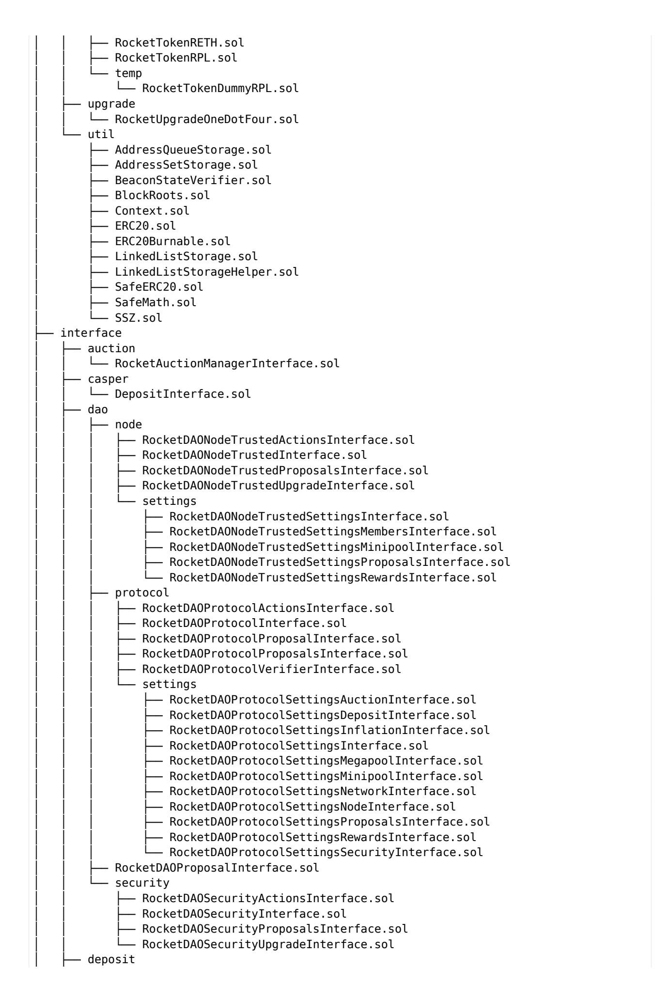

# **RocketPool Security Review**

Cantina Managed review by: **0xRajeev**, Lead Security Researcher **MiloTruck**, Lead Security Researcher

December 23, 2025

# **Contents**

| 1 | 1.1<br>1.2<br>1.3 | Introduction<br>Disclaimer<br>1.3.1 | About Cantina 3<br>3<br>Risk assessment 3<br>Severity Classification<br>3                                                                                                                                                                      | 3 |
|---|-------------------|-------------------------------------|------------------------------------------------------------------------------------------------------------------------------------------------------------------------------------------------------------------------------------------------|---|
| 2 | 2.1               |                                     | Security Review Summary<br>Scope 4                                                                                                                                                                                                             | 4 |
| 3 |                   | Findings                            |                                                                                                                                                                                                                                                | 8 |
|   | 3.1               | 3.1.1<br>3.1.2                      | Critical Risk 8<br>Malicious node operators can add validators with reused pubkeys to drain user capital<br>Linked list data structure in LinkedListStorage can be corrupted<br>8                                                              | 8 |
|   | 3.2               | High Risk<br>3.2.1                  | 9<br>Implementation of EIP-7782 changing assumed block time of 12 seconds will cause<br>protocol-wide issues 9                                                                                                                                 |   |
|   |                   | 3.2.2                               | Incorrect/repeated<br>withdrawal<br>from<br>rocketSmoothingPool<br>in<br>executeRewardSnapshot() will lead to loss of ETH rewards<br>10                                                                                                        |   |
|   |                   | 3.2.3<br>3.2.4                      | Missing contracts from the RocketUpgradeOneDotFour upgrade contract 11<br>Allowing<br>extra<br>upper<br>bits<br>for<br>indexes<br>allows<br>invalid<br>proofs<br>to<br>pass<br>in<br>BeaconStateVerifier<br>12                                 |   |
|   | 3.3               | 3.3.1                               | Medium Risk 12<br>Missing lower guardrail for reduced.bond may allow validators to stake with lower                                                                                                                                            |   |
|   |                   | 3.3.2                               | bond than expected<br>12<br>Missing guardrails for upgradeveto.quorum and upgrade.delay can affect pro<br>tocol upgrades<br>13                                                                                                                 |   |
|   |                   | 3.3.3<br>3.3.4                      | Node Operator can perpetually lock a third-party depositor funds 14<br>Mix-up between list and vector types in the SSZ library 14                                                                                                              |   |
|   | 3.4               | Low Risk<br>3.4.1<br>3.4.2          | 15<br>Use of incorrect/repeated ABIs will lead to integration errors 15<br>Missed exit challenges by oDAO will lead to loss of user capital 15                                                                                                 |   |
|   |                   | 3.4.3<br>3.4.4<br>3.4.5             | Two compromised oDAO members could collude to temporarily prevent reward<br>distributions 16<br>challengeExit() allows less than intended challenges 16<br>Megapool MEV theft penalties can be applied multiple times per block with different |   |
|   |                   | 3.4.6                               | amounts 17<br>Minipool MEV theft penalties will not be applied at 51% consensus threshold<br>17                                                                                                                                                |   |
|   |                   | 3.4.7                               | Missing forced distribution before changed capital ratio scenarios causes incorrect<br>accrued staking rewards distribution<br>18                                                                                                              |   |
|   |                   | 3.4.8<br>3.4.9                      | Allowing distribute() to be called before the first staked validator may cause<br>inaccuracy in rewards distribution 18<br>Missing upper guardrail on notify_threshold allows all exiting validators to be                                     |   |
|   |                   |                                     | penalized 19<br>3.4.10 Incorrect operator prevents the application of the maximum allowed late notification                                                                                                                                    |   |
|   |                   |                                     | fine<br>19<br>3.4.11 Missing conditional check for exit challenge creation deviates from RPIP-72 specification 20<br>3.4.12 Missing lower guardrail on late.notify.fine allows exiting validators to never                                     |   |
|   |                   |                                     | incur any late notification fine<br>20<br>3.4.13 Compromised oDAO can apply MEV theft penalty to arbitrary validators<br>21<br>3.4.14 Missing upper guardrail on maximum.megapool.eth.penalty allows validators to                             |   |
|   |                   |                                     | be arbitrarily penalized for MEV theft<br>21<br>3.4.15 Outdated<br>implementation<br>of<br>>= 2 days<br>lower<br>guardrail<br>for                                                                                                              |   |
|   |                   |                                     | megapool.time.before.dissolve deviates from specification 22<br>3.4.16 Outdated rationale for minipool.maximum.penalty.count may allow oDAO to                                                                                                 |   |
|   |                   |                                     | disproportionately penalize untransitioned minipools<br>22<br>3.4.17 Missing upper guardrail on minipool.maximum.penalty.count allows validators<br>to be arbitrarily penalized for MEV theft<br>22                                            |   |
|   |                   |                                     | 3.4.18 Missing guardrails for<br>network.reth.collateral.target may affect redemp<br>tions and staking<br>23                                                                                                                                   |   |

|     |       | 3.4.19 Missing upper guardrail for network.submit.balances.frequency may prevent                 |    |
|-----|-------|--------------------------------------------------------------------------------------------------|----|
|     |       | timely network balance updates 23                                                                |    |
|     |       | 3.4.20 RPL price update frequency is never enforced on oDAO 24                                   |    |
|     |       | 3.4.21 Missing guardrails for node.unstaking.period can cause unexpected withdrawal              |    |
|     |       | behaviors<br>24                                                                                  |    |
|     |       | 3.4.22 Missing upper guardrail for node.voting.power.stake.maximum allows bypass                 |    |
|     |       | of RPL clamping to increase voting power<br>25                                                   |    |
|     |       | 3.4.23 Security Council proposals will pass at 50% member quorum threshold<br>25                 |    |
|     |       | 3.4.24 A single compromised Security Council member can veto an upgrade proposal 25              |    |
|     |       | 3.4.25 Upgrade delay of 7 days may be insufficient given the current validator exit queue        |    |
|     |       | wait times<br>26                                                                                 |    |
|     |       | 3.4.26 Setting<br>is<br>incorrectly<br>implemented<br>as<br>SC<br>network.submit.prices.enabled  |    |
|     |       | changeable parameter without delay<br>26                                                         |    |
|     |       | 3.4.27 Missing guardrails for members.rplbond allows current members to manipulate               |    |
|     |       | oDAO 27                                                                                          |    |
|     |       | 3.4.28 Missing guardrails for oDAO challenge times may make the challenge process ineffective 27 |    |
|     |       | 3.4.29 Missing guardrails on members.challenge.cost allow members to prevent non                 |    |
|     |       | member challenges or allow spamming<br>27                                                        |    |
|     |       | 3.4.30 Missing guardrails on oDAO voting settings can make the proposal voting process           |    |
|     |       | ineffective<br>28                                                                                |    |
|     |       | 3.4.31 Missing check allows challenged members to refute beyond the challenge window 28          |    |
|     |       | 3.4.32 Missing check allows a challenge proposer to also later remove the challenged member 29   |    |
|     |       | 3.4.33 getQueueTop() returns an incorrect validator 30                                           |    |
|     |       | 3.4.34 Missing upper guardrail for megapool.time.before.dissolve can prevent valida              |    |
|     |       | tors from being dissolved 30                                                                     |    |
|     |       | 3.4.35 Unchecked<br>state<br>transition<br>may<br>lead<br>to<br>unexpected<br>behavior<br>in     |    |
|     |       | setUseLatestDelegate()<br>30                                                                     |    |
|     |       | 3.4.36 Missing sanity check for _stakingEth <= _totalEth could cause unexpected be               |    |
|     |       | havior 31                                                                                        |    |
|     |       | 3.4.37 Allowing pDAO to control voter share of revenue is risky<br>31                            |    |
|     |       | 3.4.38 Nodes can withdraw ETH or credits even if they have outstanding protocol debt<br>32       |    |
|     |       | 3.4.39 Missed deletion of pending withdrawal address allows a potentially untrusted one to       |    |
|     |       | set itself as withdrawal address<br>32                                                           |    |
|     |       | 3.4.40 Incorrect uint64 casts in RocketDepositPool.getQueueTop()<br>33                           |    |
|     |       | 3.4.41 Missing onlyThisLatestContract modifier for functions in RocketDepositPool                | 33 |
|     |       | 3.4.42 Improvements for BeaconStateVerifier and the SSZ library<br>34                            |    |
| 3.5 |       | Gas Optimization<br>34                                                                           |    |
|     | 3.5.1 | Gas optimizations<br>34                                                                          |    |
| 3.6 |       | Informational<br>35                                                                              |    |
|     |       |                                                                                                  |    |
|     | 3.6.1 | RocketMegapoolManager functions can make arbitrary external calls 35                             |    |
|     | 3.6.2 | Hardcoding consensus threshold for Megapool penalty enforcement prevents any                     |    |
|     |       | required modification<br>35                                                                      |    |
|     | 3.6.3 | Specification of lower guardrail for Megapool MEV theft penalty is contradicting<br>35           |    |
|     | 3.6.4 | Avoid hardcoding the gas amount passed to the sha256 precompile<br>36                            |    |
|     | 3.6.5 | Unused code reduces readability<br>36                                                            |    |
|     | 3.6.6 | Excess caller privileges provided in function access control is risky 37                         |    |
|     | 3.6.7 | Missing sanity checks could cause unexpected behavior 38                                         |    |
|     | 3.6.8 | Use of pragma abicoder v2 is unnecessary 38                                                      |    |
|     | 3.6.9 | Not using leading underscore for private/internal function names reduces readability             | 39 |
|     |       | 3.6.10 Resetting validator.expressUsed and validator.lastAssignmentTime will                     |    |
|     |       | avoid stale values 39                                                                            |    |

# <span id="page-3-0"></span>**1 Introduction**

# <span id="page-3-1"></span>**1.1 About Cantina**

Cantina is a security services marketplace that connects top security researchers and solutions with clients. Learn more at [cantina.xyz](https://cantina.xyz)

# <span id="page-3-2"></span>**1.2 Disclaimer**

Cantina Managed provides a detailed evaluation of the security posture of the code at a particular moment based on the information available at the time of the review. While Cantina Managed endeavors to identify and disclose all potential security issues, it cannot guarantee that every vulnerability will be detected or that the code will be entirely secure against all possible attacks. The assessment is conducted based on the specific commit and version of the code provided. Any subsequent modifications to the code may introduce new vulnerabilities that were absent during the initial review. Therefore, any changes made to the code require a new security review to ensure that the code remains secure. Please be advised that the Cantina Managed security review is not a replacement for continuous security measures such as penetration testing, vulnerability scanning, and regular code reviews.

# <span id="page-3-3"></span>**1.3 Risk assessment**

| Severity level     | Impact: High | Impact: Medium | Impact: Low |
|--------------------|--------------|----------------|-------------|
| Likelihood: high   | Critical     | High           | Medium      |
| Likelihood: medium | High         | Medium         | Low         |
| Likelihood: low    | Medium       | Low            | Low         |

#### <span id="page-3-4"></span>**1.3.1 Severity Classification**

The severity of security issues found during the security review is categorized based on the above table. Critical findings have a high likelihood of being exploited and must be addressed immediately. High findings are almost certain to occur, easy to perform, or not easy but highly incentivized thus must be fixed as soon as possible.

Medium findings are conditionally possible or incentivized but are still relatively likely to occur and should be addressed. Low findings are a rare combination of circumstances to exploit, or offer little to no incentive to exploit but are recommended to be addressed.

Lastly, some findings might represent objective improvements that should be addressed but do not impact the project's overall security (Gas and Informational findings).

# <span id="page-4-0"></span>**2 Security Review Summary**

Rocket Pool is the leading decentralised liquid staking protocol for Ethereum.

From Jul 27th to Sep 21st the Cantina team conducted a review of [rocketpool](https://github.com/rocket-pool/rocketpool) on commit hash [56ea8976.](https://github.com/rocket-pool/rocketpool/tree/56ea8976a5ccafb553b0eb613bd62fd19a8d5aa8/) The team identified a total of **63** issues:

#### **Issues Found**

| Severity          | Count | Fixed | Acknowledged |
|-------------------|-------|-------|--------------|
| Critical Risk     | 2     | 2     | 0            |
| High Risk         | 4     | 4     | 0            |
| Medium Risk       | 4     | 4     | 0            |
| Low Risk          | 42    | 26    | 16           |
| Gas Optimizations | 1     | 1     | 0            |
| Informational     | 10    | 9     | 1            |
| Total             | 63    | 46    | 17           |

# <span id="page-4-1"></span>**2.1 Scope**

The security review had the following components in scope for [rocketpool](https://github.com/rocket-pool/rocketpool) on commit hash [56ea8976:](https://github.com/rocket-pool/rocketpool/tree/56ea8976a5ccafb553b0eb613bd62fd19a8d5aa8/)


| │ | │<br>└── RocketDAOProtocolSettingsSecurity.sol |
|---|------------------------------------------------|
| │ | ├── RocketDAOProposal.sol                      |
| │ | └── security                                   |
| │ | ├── RocketDAOSecurity.sol                      |
| │ | ├── RocketDAOSecurityActions.sol               |
| │ | ├── RocketDAOSecurityProposals.sol             |
| │ | └── RocketDAOSecurityUpgrade.sol               |
|   | ├── deposit                                    |
| │ | └── RocketDepositPool.sol                      |
|   | ├── helper                                     |
| │ | ├── BeaconRootsMock.sol                        |
| │ | ├── BeaconStateVerifierMock.sol                |
| │ | ├── BlockRootsMock.sol                         |
| │ | ├── MegapoolUpgradeHelper.sol                  |
| │ | ├── PenaltyTest.sol                            |
| │ | ├── RevertOnTransfer.sol                       |
| │ | ├── SnapshotTest.sol                           |
| │ | ├── StakeHelper.sol                            |
| │ | └── StorageHelper.sol                          |
|   | ├── megapool                                   |
| │ | ├── RocketMegapoolDelegate.sol                 |
| │ | ├── RocketMegapoolDelegateBase.sol             |
| │ | ├── RocketMegapoolFactory.sol                  |
| │ | ├── RocketMegapoolManager.sol                  |
| │ | ├── RocketMegapoolPenalties.sol                |
| │ | ├── RocketMegapoolProxy.sol                    |
| │ | └── RocketMegapoolStorageLayout.sol            |
|   | ├── minipool                                   |
| │ | ├── RocketMinipoolBase.sol                     |
| │ | ├── RocketMinipoolBondReducer.sol              |
| │ | ├── RocketMinipoolDelegate.sol                 |
| │ | ├── RocketMinipoolFactory.sol                  |
| │ | ├── RocketMinipoolManager.sol                  |
| │ | ├── RocketMinipoolPenalty.sol                  |
| │ | ├── RocketMinipoolQueue.sol                    |
| │ | └── RocketMinipoolStorageLayout.sol            |
|   | ├── network                                    |
| │ | ├── RocketNetworkBalances.sol                  |
| │ | ├── RocketNetworkFees.sol                      |
| │ | ├── RocketNetworkPenalties.sol                 |
| │ | ├── RocketNetworkPrices.sol                    |
| │ | ├── RocketNetworkRevenues.sol                  |
| │ | ├── RocketNetworkSnapshots.sol                 |
| │ | └── RocketNetworkVoting.sol                    |
|   | ├── node                                       |
| │ | ├── RocketNodeDeposit.sol                      |
| │ | ├── RocketNodeDistributor.sol                  |
| │ | ├── RocketNodeDistributorDelegate.sol          |
| │ | ├── RocketNodeDistributorFactory.sol           |
| │ | ├── RocketNodeDistributorStorageLayout.sol     |
| │ | ├── RocketNodeManager.sol                      |
| │ | └── RocketNodeStaking.sol                      |
|   | ├── rewards                                    |
| │ | ├── RocketClaimDAO.sol                         |
| │ | ├── RocketMerkleDistributorMainnet.sol         |
| │ | ├── RocketRewardsPool.sol                      |
| │ | └── RocketSmoothingPool.sol                    |
|   | ├── RocketBase.sol                             |
|   | ├── RocketStorage.sol                          |
|   | ├── RocketVault.sol                            |
|   | ├── token                                      |
|   |                                                |



| │      | │<br>└── RocketDepositPoolInterface.sol                                                        |
|--------|------------------------------------------------------------------------------------------------|
| │      | ├── megapool                                                                                   |
| │      | │<br>├── RocketMegapoolDelegateBaseInterface.sol                                               |
| │      | │<br>├── RocketMegapoolDelegateInterface.sol                                                   |
| │      | │<br>├── RocketMegapoolFactoryInterface.sol                                                    |
| │      | │<br>├── RocketMegapoolInterface.sol                                                           |
| │      | │<br>├── RocketMegapoolManagerInterface.sol                                                    |
| │      | │<br>├── RocketMegapoolPenaltiesInterface.sol                                                  |
| │      | │<br>└── RocketMegapoolProxyInterface.sol                                                      |
| │      | ├── minipool                                                                                   |
| │      | │<br>├── RocketMinipoolBaseInterface.sol                                                       |
| │<br>│ | │<br>├── RocketMinipoolBondReducerInterface.sol<br>│<br>├── RocketMinipoolFactoryInterface.sol |
| │      | │<br>├── RocketMinipoolInterface.sol                                                           |
| │      | │<br>├── RocketMinipoolManagerInterface.sol                                                    |
| │      | │<br>├── RocketMinipoolPenaltyInterface.sol                                                    |
| │      | │<br>└── RocketMinipoolQueueInterface.sol                                                      |
| │      | ├── network                                                                                    |
| │      | │<br>├── RocketNetworkBalancesInterface.sol                                                    |
| │      | │<br>├── RocketNetworkFeesInterface.sol                                                        |
| │      | │<br>├── RocketNetworkPenaltiesInterface.sol                                                   |
| │      | │<br>├── RocketNetworkPricesInterface.sol                                                      |
| │      | │<br>├── RocketNetworkRevenuesInterface.sol                                                    |
| │      | │<br>├── RocketNetworkSnapshotsInterface.sol                                                   |
| │      | │<br>└── RocketNetworkVotingInterface.sol                                                      |
| │<br>│ | ├── node<br>│<br>├── RocketNodeDepositInterface.sol                                            |
| │      | │<br>├── RocketNodeDistributorFactoryInterface.sol                                             |
| │      | │<br>├── RocketNodeDistributorInterface.sol                                                    |
| │      | │<br>├── RocketNodeManagerInterface.sol                                                        |
| │      | │<br>└── RocketNodeStakingInterface.sol                                                        |
| │      | ├── rewards                                                                                    |
| │      | │<br>├── claims                                                                                |
| │      | │<br>│<br>├── RocketClaimDAOInterface.sol                                                      |
| │      | │<br>│<br>├── RocketClaimNodeInterface.sol                                                     |
| │      | │<br>│<br>└── RocketClaimTrustedNodeInterface.sol                                              |
| │      | │<br>├── RocketMerkleDistributorMainnetInterface.sol                                           |
| │      | │<br>├── RocketRewardsPoolInterface.sol                                                        |
| │      | │<br>├── RocketRewardsRelayInterface.sol                                                       |
| │<br>│ | │<br>└── RocketSmoothingPoolInterface.sol<br>├── RocketStorageInterface.sol                    |
| │      | ├── RocketVaultInterface.sol                                                                   |
| │      | ├── RocketVaultWithdrawerInterface.sol                                                         |
| │      | ├── token                                                                                      |
| │      | │<br>├── RocketTokenRETHInterface.sol                                                          |
| │      | │<br>└── RocketTokenRPLInterface.sol                                                           |
| │      | └── util                                                                                       |
| │      | ├── AddressQueueStorageInterface.sol                                                           |
| │      | ├── AddressSetStorageInterface.sol                                                             |
| │      | ├── BeaconStateVerifierInterface.sol                                                           |
| │      | ├── BlockRootsInterface.sol                                                                    |
| │      | ├── IERC20.sol                                                                                 |
| │      | ├── IERC20Burnable.sol                                                                         |
| │      | └── LinkedListStorageInterface.sol<br>└── types                                                |
|        | ├── MinipoolDeposit.sol                                                                        |
|        | ├── MinipoolDetails.sol                                                                        |
|        | ├── MinipoolStatus.sol                                                                         |
|        | ├── NodeDetails.sol                                                                            |
|        | ├── RewardSubmission.sol                                                                       |
|        | └── SettingType.sol                                                                            |

# <span id="page-8-0"></span>**3 Findings**

# <span id="page-8-1"></span>**3.1 Critical Risk**

#### <span id="page-8-2"></span>**3.1.1 Malicious node operators can add validators with reused pubkeys to drain user capital**

**Severity:** Critical Risk

**Context:** [RocketNodeDeposit.sol#L184-L185,](https://cantina.xyz/code/2768a401-c477-42fc-9e31-b2b17846207c/contracts/contract/node/RocketNodeDeposit.sol#L184-L185) [RocketNodeDeposit.sol#L223-L224](https://cantina.xyz/code/2768a401-c477-42fc-9e31-b2b17846207c/contracts/contract/node/RocketNodeDeposit.sol#L223-L224)

**Summary:** Missing check for unique validator pubkeys across protocol Megapools allows malicious node operators to add new validators with pubkeys from their already staking validators, which allows them to drain borrowed user deposit pool capital from protocol via partial withdrawals skimmed when such validators' actual balance exceeds MAX\_EFFECTIVE\_BALANCE.

**Finding Description:** When a validator's actual balance exceeds MAX\_EFFECTIVE\_BALANCE of 32 ETH on the beacon chain, that surplus balance is treated as validator rewards and therefore is periodically skimmed by the consensus layer to the validator's withdrawal credentials. Any top-up deposits in excess of MAX\_EFFECTIVE\_BALANCE is also treated similarly.

The Megapool implementation allows RocketNodeDeposit to deposit towards single/multiple validators via deposit() and depositMulti(). However, such node operator (NO) provided validators are added to the protocol without checking if their validatorPubkey is unique across the protocol registered validators. This missing check allows malicious NOs to add new validators reusing pubkeys from their already staking validators.

**Note:** The team independently found this issue after the start of the review.

**Impact Explanation:** High, because reusing pubkeys from already staking validators allows malicious NOs to borrow user deposit pool capital from protocol towards further staking deposits for such validators. Such top-up deposits will cause validators' actual balance to exceed MAX\_EFFECTIVE\_BALANCE of 32 ETH, which makes them be treated as rewards and therefore skimmed as partial withdrawals for those validators. This effectively leads to a loss of protocol's user deposit pool capital as validator rewards. This can be done repeatedly by any malicious NO causing a drain of user provided capital and lead to a depeg of rETH.

**Likelihood Explanation:** High, because any participating NO can exploit this issue.

**Recommendation:** Consider tracking pubkeys of protocol registered validators to ensure that only unique validators are added.

**RocketPool:** Fixed in commit [a3bc26ba](https://github.com/rocket-pool/rocketpool/commit/a3bc26ba3cb26a2952e93fc99ddfe20d3f5b4849) by ensuring global uniqueness of all pubkeys in megapools across the protocol.

**Cantina Managed:** Fix verified.

#### <span id="page-8-3"></span>**3.1.2 Linked list data structure in LinkedListStorage can be corrupted**

**Severity:** Critical Risk

**Context:** [LinkedListStorage.sol#L134-L164,](https://github.com/rocket-pool/rocketpool/blob/56ea8976a5ccafb553b0eb613bd62fd19a8d5aa8/contracts/contract/util/LinkedListStorage.sol#L134-L164) [LinkedListStorage.sol#L95-L102](https://github.com/rocket-pool/rocketpool/blob/56ea8976a5ccafb553b0eb613bd62fd19a8d5aa8/contracts/contract/util/LinkedListStorage.sol#L95-L102)

**Description:** In LinkedListStorage.\_dequeueItem(), there are three storage variables that aren't cleared for start (i.e. the first item in the queue) in this function:

- namespace.next and namespace.prev.
- namespace.item.

namespace.prev doesn't need to be cleared as it is already 0 for the first item. However, namespace.next needs to be cleared as \_enqueueItem() doesn't always set namespace.next for new items. More specifically, when enqueuing an item in an empty queue, .next isn't set (i.e. the else branch below):

```
if (endIndex > 0) {
    setUint(keccak256(abi.encodePacked(_namespace, ".next", endIndex)), newIndex);
    setUint(keccak256(abi.encodePacked(_namespace, ".prev", newIndex)), endIndex);
} else {
```

```
// clear the 64 bits used to stored the 'start' pointer
    data &= ~(uint256(ones64Bits) << startOffset);
    data |= newIndex << startOffset;
}
```

An attacker can manipulate the dangling next pointers to corrupt the storage of the queue, since \_dequeueItem() and \_removeItem() rely on namespace.next[index] > 0 to check if a next item exists.

For example, the proof of concept at [gist 0fb95240](https://gist.github.com/MiloTruck/0fb95240eddac970e260fe0ff38d6a65) demonstrates how storage can be corrupted such that peekItem() returns the wrong value.

Additionally, namespace.item should be cleared, otherwise getItem() and scan() could return items that were previously removed from the queue since they do not perform any checks on the index being queried. This also applies to \_removeItem(), which doesn't clear namespace.item as well.

**Recommendation:** The following state variables should be cleared:

- namespace.next in \_dequeueItem().
- namespace.item in \_dequeueItem() and \_removeItem().

**RocketPool:** Fixed in commit [ad5d7b9f.](https://github.com/rocket-pool/rocketpool/commit/ad5d7b9f69e7b19ce0734a7a794d4c1521e6d99b) We have also replaced setUint(..., 0) with deleteUint for enhanced readibility.

**Cantina Managed:** Verified, \_dequeueItem() and \_removeItem() now clears all state variables are cleared where approriate.

#### <span id="page-9-0"></span>**3.2 High Risk**

#### <span id="page-9-1"></span>**3.2.1 Implementation of EIP-7782 changing assumed block time of 12 seconds will cause protocolwide issues**

**Severity:** High Risk

**Context:** [RocketDAOProtocolSettingsAuction.sol#L19,](https://cantina.xyz/code/2768a401-c477-42fc-9e31-b2b17846207c/contracts/contract/dao/protocol/settings/RocketDAOProtocolSettingsAuction.sol#L19) [RocketDAOProtocolSettingsAuction.sol#L38-L40,](https://cantina.xyz/code/2768a401-c477-42fc-9e31-b2b17846207c/contracts/contract/dao/protocol/settings/RocketDAOProtocolSettingsAuction.sol#L38-L40) [RocketDAOProtocolSettingsAuction.sol#L73-L76,](https://cantina.xyz/code/2768a401-c477-42fc-9e31-b2b17846207c/contracts/contract/dao/protocol/settings/RocketDAOProtocolSettingsAuction.sol#L73-L76) [RocketDAOProtocolSettingsProposals.sol#L24,](https://cantina.xyz/code/2768a401-c477-42fc-9e31-b2b17846207c/contracts/contract/dao/protocol/settings/RocketDAOProtocolSettingsProposals.sol#L24) [Rocket-](https://cantina.xyz/code/2768a401-c477-42fc-9e31-b2b17846207c/contracts/contract/dao/protocol/settings/RocketDAOProtocolSettingsProposals.sol#L61-L64)[DAOProtocolSettingsProposals.sol#L61-L64,](https://cantina.xyz/code/2768a401-c477-42fc-9e31-b2b17846207c/contracts/contract/dao/protocol/settings/RocketDAOProtocolSettingsProposals.sol#L61-L64) [RocketDAOProtocolSettingsProposals.sol#L114-L117,](https://cantina.xyz/code/2768a401-c477-42fc-9e31-b2b17846207c/contracts/contract/dao/protocol/settings/RocketDAOProtocolSettingsProposals.sol#L114-L117) [Rocket-](https://cantina.xyz/code/2768a401-c477-42fc-9e31-b2b17846207c/contracts/contract/megapool/RocketMegapoolDelegateBase.sol#L13)[MegapoolDelegateBase.sol#L13,](https://cantina.xyz/code/2768a401-c477-42fc-9e31-b2b17846207c/contracts/contract/megapool/RocketMegapoolDelegateBase.sol#L13) [RocketMegapoolDelegate.sol#L24,](https://cantina.xyz/code/2768a401-c477-42fc-9e31-b2b17846207c/contracts/contract/megapool/RocketMegapoolDelegate.sol#L24) [RocketMegapoolDelegate.sol#L401-](https://cantina.xyz/code/2768a401-c477-42fc-9e31-b2b17846207c/contracts/contract/megapool/RocketMegapoolDelegate.sol#L401-L406) [L406](https://cantina.xyz/code/2768a401-c477-42fc-9e31-b2b17846207c/contracts/contract/megapool/RocketMegapoolDelegate.sol#L401-L406), [RocketMegapoolDelegate.sol#L510,](https://cantina.xyz/code/2768a401-c477-42fc-9e31-b2b17846207c/contracts/contract/megapool/RocketMegapoolDelegate.sol#L510) [RocketMegapoolDelegate.sol#L523,](https://cantina.xyz/code/2768a401-c477-42fc-9e31-b2b17846207c/contracts/contract/megapool/RocketMegapoolDelegate.sol#L523) [RocketMegapoolDele](https://cantina.xyz/code/2768a401-c477-42fc-9e31-b2b17846207c/contracts/contract/megapool/RocketMegapoolDelegate.sol#L561-L564)[gate.sol#L561-L564](https://cantina.xyz/code/2768a401-c477-42fc-9e31-b2b17846207c/contracts/contract/megapool/RocketMegapoolDelegate.sol#L561-L564), [RocketMegapoolDelegate.sol#L587-L588,](https://cantina.xyz/code/2768a401-c477-42fc-9e31-b2b17846207c/contracts/contract/megapool/RocketMegapoolDelegate.sol#L587-L588) [RocketMegapoolDelegate.sol#L690-L696,](https://cantina.xyz/code/2768a401-c477-42fc-9e31-b2b17846207c/contracts/contract/megapool/RocketMegapoolDelegate.sol#L690-L696) [RocketMegapoolDelegate.sol#L699-L704,](https://cantina.xyz/code/2768a401-c477-42fc-9e31-b2b17846207c/contracts/contract/megapool/RocketMegapoolDelegate.sol#L699-L704) [RocketMegapoolPenalties.sol#L15,](https://cantina.xyz/code/2768a401-c477-42fc-9e31-b2b17846207c/contracts/contract/megapool/RocketMegapoolPenalties.sol#L15) [RocketMegapoolPenal](https://cantina.xyz/code/2768a401-c477-42fc-9e31-b2b17846207c/contracts/contract/megapool/RocketMegapoolPenalties.sol#L89-L94)[ties.sol#L89-L94](https://cantina.xyz/code/2768a401-c477-42fc-9e31-b2b17846207c/contracts/contract/megapool/RocketMegapoolPenalties.sol#L89-L94), [RocketNetworkPenalties.sol#L16,](https://cantina.xyz/code/2768a401-c477-42fc-9e31-b2b17846207c/contracts/contract/network/RocketNetworkPenalties.sol#L16) [RocketNetworkPenalties.sol#L128-L133,](https://cantina.xyz/code/2768a401-c477-42fc-9e31-b2b17846207c/contracts/contract/network/RocketNetworkPenalties.sol#L128-L133) [Block-](https://cantina.xyz/code/2768a401-c477-42fc-9e31-b2b17846207c/contracts/contract/util/BlockRoots.sol#L19)[Roots.sol#L19](https://cantina.xyz/code/2768a401-c477-42fc-9e31-b2b17846207c/contracts/contract/util/BlockRoots.sol#L19), [BlockRoots.sol#L29-L38](https://cantina.xyz/code/2768a401-c477-42fc-9e31-b2b17846207c/contracts/contract/util/BlockRoots.sol#L29-L38)

**Summary:** Implementation of [EIP-7782,](https://eips.ethereum.org/EIPS/eip-7782) which proposes reducing block times from 12s to 6s, will cause protocol-wide issues because block times are hardcoded to be 12 seconds across the implementation.

**Finding Description:** Block/slot times are currently 12 seconds but EIP-7782, which proposes reducing block times from 12s to 6s, is under consideration for the upcoming hard forks. This is part of Ethereum's "Scale L1" focus where block times will be reduced over time for scaling.

However, the protocol hardcodes block/slot times to be 12 seconds across the implementation. When this changes in upcoming forks, this will cause protocol-wide issues as illustrated below:

- 1. RocketMegapoolDelegate uses secondsPerSlot = 12 for calculating withdrawableTime in notifyExit(), which will not apply getLateNotifyFine() when changed.
- 2. RocketMegapoolDelegate uses secondsPerSlot = 12 for calculating distributableTime in notifyFinalBalance(), which will not allow timely permissionless distribution when changed.
- 3. RocketMegapoolDelegate uses secondsPerSlot = 12 for calculating current epoch in getCurrentEpoch(), which will allow distribute() to treat accrued balance from exiting validators as rewards because the check currentEpoch >= soonestWithdrawableEpoch will be incorrect.
- 4. RocketMegapoolDelegate uses secondsPerSlot = 12 for calculating current slot in getCurrentSlot(), which will register a lower value for validator.lockedSlot in

challengeExit() and allow a malicious node operator to successfully call notifyNotExit() while exiting and stealing protocol funds.

- 5. BlockRoots uses secondsPerSlot for calculating earliestTimestamp = block.timestamp (beaconRootsHistoryBufferLength \* secondsPerSlot), which will cause getBlockRoot() to malfunction and affect all proof verifications.
- 6. RocketMegapoolDelegateBase uses upgradeBuffer = 864000; // ~120 days by calculating using 12s block times, which allows delegates to expire only after twice the intended expiration period. Note that this contract cannot be upgraded.
- 7. RocketMegapoolPenalties uses penaltyMaximumPeriod = 50400 (blocks/slots per week), which allows protocol to impose rocketDAOProtocolSettingsMegapool.getMaximumEthPenalty() amount of penalty over twice the intended window i.e. less than expected.
- 8. RocketNetworkPenalties uses penaltyMaximumPeriod = 50400 (blocks/slots per week), which allows protocol to impose rocketDAOProtocolSettingsMinipool.getMaximumPenaltyCount() times of penalty over twice the intended window i.e. less than expected.
- 9. RocketDAOProtocolSettingsAuction uses setSettingUint("auction.lot.duration", 50400) with a guardrail of require(\_value >= 7200, "Value must be >= 7200") where the values are based on 12s block/slot times, which allows maximum auction duration in blocks returned from getLotDuration() to be twice the intended period.
- 10. RocketDAOProtocolSettingsProposals uses setSettingUint("proposal.max.block.age", 1024) with a guardrail of

```
require(_value > 128 && _value < 7200, "Value must be > 128 blocks & < 7200
,→ blocks")
```

where the values are based on 12s block/slot times, which allows the maximum time in the past (in blocks) a proposal can be submitted as returned from getProposalMaxBlockAge() to be twice the intended period.

**Impact Explanation:** High, because it causes various critical protocol functionalities to be incorrect (as itemized above) even causing a loss of user funds.

**Likelihood Explanation:** Medium, because this reduction of block/slot times as specified in EIP-7782 is a top priority for scaling L1 and is planned to consideration in upcoming hardforks.

**Recommendation:** Consider removing the hardcode assumption of 12s block/slot times across contracts to consolidate it in one place as a pDAO setting, where it can be initialized to 12s for now and later reset if/when required.

**RocketPool:** Fixed in commit [85a1c01c.](https://github.com/rocket-pool/rocketpool/commit/85a1c01c0b866b4b67b654923ebca4f24c8fc2ed)

**Cantina Managed:** Fix verified.

#### <span id="page-10-0"></span>**3.2.2 Incorrect/repeated withdrawal from rocketSmoothingPool in executeRewardSnapshot() will lead to loss of ETH rewards**

**Severity:** High Risk

**Context:** [RocketRewardsPool.sol#L254-L256,](https://cantina.xyz/code/2768a401-c477-42fc-9e31-b2b17846207c/contracts/contract/rewards/RocketRewardsPool.sol#L254-L256) [RocketRewardsPool.sol#L302-L305](https://cantina.xyz/code/2768a401-c477-42fc-9e31-b2b17846207c/contracts/contract/rewards/RocketRewardsPool.sol#L302-L305)

**Summary:** Incorrect/repeated withdrawal from rocketSmoothingPool in executeRewardSnapshot() will revert if rocketSmoothingPool doesn't have sufficient balance, or lead to stuck ETH in RocketRewardsPool.

**Finding Description:** RocketRewardsPool implements distribution of RPL and ETH rewards generated by the network. \_executeRewardSnapshot() executes reward snapshot and sends assets to the relays for distribution to reward recipients.

Rocketpool implements a [smoothing pool](https://docs.rocketpool.net/guides/node/fee-distrib-sp#the-smoothing-pool) feature, which is documented as:

The Smoothing Pool is a unique opt-in feature of the Rocket Pool network that is available to our node operators. Essentially, it becomes the fee recipient for every node operator that opts into it and collectively accumulates the priority fees from blocks proposed by those node operators into one large pool. During a Rocket Pool rewards checkpoint (the same ones used to distribute RPL rewards), the total ETH balance of the pool is distributed fairly to the pool stakers and the node operators that opted into it.

For node operators opting into smoothing pool, the reward snapshot submission withdraws ETH from rocketSmoothingPool in \_executeRewardSnapshot():

```
if (_submission.smoothingPoolETH > 0) {
   rocketSmoothingPool.withdrawEther(address(this), _submission.smoothingPoolETH);
}
```

However, later in \_executeRewardSnapshot(), instead of sending the withdrawn ETH to relay from address(this), it again attempts to withdraw ETH from rocketSmoothingPool for the same purpose:

```
if (rewardsETH > 0) {
    // ETH rewards are withdrawn from the smoothing pool
    rocketSmoothingPool.withdrawEther(address(relay), rewardsETH);
}
```

**Note:** The team independently found this issue after the start of the review.

**Impact Explanation:** Medium, because this will revert if rocketSmoothingPool doesn't have sufficient balance, or lead to stuck ETH in RocketRewardsPool. Given that the latter is more likely, this will lead to accumulated and ongoing loss of ETH rewards for node operators in each reward cycle.

**Likelihood Explanation:** High, because this happens unconditionally for every reward cycle if any node operator has opted into Smoothing Pool. Given that Smoothing Pool is encouraged for predictable and outperforming rewards (compared to Solitary mode), it is very likely that many node operators opt into it.

**Recommendation:** Consider replacing the second rocketSmoothingPool.withdrawEther() call with a sending of rewardsETH from address(this).

**RocketPool:** Fixed in commit [ac08a13a.](https://github.com/rocket-pool/rocketpool/commit/ac08a13a9a6843347c134c9897b2813ebd3e8463)

**Cantina Managed:** Fix verified.

#### <span id="page-11-0"></span>**3.2.3 Missing contracts from the RocketUpgradeOneDotFour upgrade contract**

**Severity:** High Risk

**Context:** [RocketUpgradeOneDotFour.sol,](https://github.com/rocket-pool/rocketpool/blob/56ea8976a5ccafb553b0eb613bd62fd19a8d5aa8/contracts/contract/upgrade/RocketUpgradeOneDotFour.sol) [RocketMinipoolManager.sol,](https://github.com/rocket-pool/rocketpool/blob/56ea8976a5ccafb553b0eb613bd62fd19a8d5aa8/contracts/contract/minipool/RocketMinipoolManager.sol) [RocketMegapoolPenalties.sol](https://github.com/rocket-pool/rocketpool/blob/56ea8976a5ccafb553b0eb613bd62fd19a8d5aa8/contracts/contract/megapool/RocketMegapoolPenalties.sol)

**Description:** Two contracts are missing from the RocketUpgradeOneDotFour upgrade contract:

- RocketMinipoolManager, which is an existing contract that should be upgraded.
- RocketMegapoolPenalties, which is a new contract.

As a result, upgrade 1.4 will have missing functionality.

**Recommendation:** Add both contracts to RocketUpgradeOneDotFour.

**RocketPool:** Fixed. Added RocketMinipoolManager in commit [525b63ec](https://github.com/rocket-pool/rocketpool/commit/525b63ecd81a9dd407ddbff82d943e7bb5233e90) and RocketMegapoolPenalties in commit [ca3d8ebc.](https://github.com/rocket-pool/rocketpool/commit/ca3d8ebc1cfc2cfa87d8e9538215938019ca53bd)

**Note:** Due to exceeding the contract size limit in the upgrade contract, we had to modify the storage to a single array of addresses instead of a single variable for each contract.

**Note:** The version number also needed to be bumped in RocketMinipoolManager.

**Cantina Managed:** Verified, both contracts have been added as recommended.

#### <span id="page-12-0"></span>**3.2.4 Allowing extra upper bits for indexes allows invalid proofs to pass in BeaconStateVerifier**

**Severity:** High Risk

**Context:** [BeaconStateVerifier.sol#L125-L129,](https://github.com/rocket-pool/rocketpool/blob/56ea8976a5ccafb553b0eb613bd62fd19a8d5aa8/contracts/contract/util/BeaconStateVerifier.sol#L125-L129) [BeaconStateVerifier.sol#L147-L153](https://github.com/rocket-pool/rocketpool/blob/56ea8976a5ccafb553b0eb613bd62fd19a8d5aa8/contracts/contract/util/BeaconStateVerifier.sol#L147-L153)

**Description:** In BeaconStateVerifier.pathBeaconStateToValidator(), \_validatorIndex is specified as a uint256:

```
function pathBeaconStateToValidator(uint256 _validatorIndex) internal view returns
,→ (SSZ.Path memory) {
    SSZ.Path memory path = SSZ.from(11, 6); // 0b001011 (BeaconState -> validators)
    path = SSZ.concat(path, SSZ.intoVector(_validatorIndex, 40)); // validators ->
    ,→ validators[n]
    return path;
}
```

However, it should be declared as uint40 instead as the length of the validators list is 40, which means its index should only be 40 bits. Under the hood, the final gIndex returned by path is:

```
gIndex = (11 << 41) | _validatorIndex
```

If \_validatorIndex is greater than 40 bits, it will end up overwriting the gIndex of the BeaconState -> validators path. This can be abused by an attacker to switch from the validators field to any field after it in BeaconState, thereby forging invalid proofs.

Similarly, in pathBlockToWithdrawal(), \_withdrawalNum should be restricted to 4 bits since the length of the withdrawals list is 4:

```
function pathBlockToWithdrawal(uint256 _withdrawalNum) internal view returns (SSZ.Path
,→ memory) {
    SSZ.Path memory path = SSZ.from(4, 3); // 0b100 (BeaconBlockHeader -> body_root)
    path = SSZ.concat(path, SSZ.from(9, 4)); // 0b1001 (BeaconBlockBody ->
    ,→ execution_payload)
    path = SSZ.concat(path, SSZ.from(14, 5)); // 0b01110 (ExecutionPayload ->
    ,→ withdrawals)
    path = SSZ.concat(path, SSZ.intoList(_withdrawalNum, 5)); // withdrawals ->
    ,→ withdrawals[n]
    return path;
}
```

**Recommendation:** Restrict the data types of indexes passed:

- In pathBeaconStateToValidator(), change \_validatorIndex to uint40.
- In pathBlockToWithdrawal(), change \_withdrawalNum to uint16.

Additionally, add a gIndex < 2 \*\* length check in from(), intoVector() and intoList().

**RocketPool:** Fixed in commit [303453a4.](https://github.com/rocket-pool/rocketpool/commit/303453a422e049431408f14eac0b034890683242)

**Cantina Managed:** Verified, the recommended fix was implemented.

## <span id="page-12-1"></span>**3.3 Medium Risk**

#### <span id="page-12-2"></span>**3.3.1 Missing lower guardrail for reduced.bond may allow validators to stake with lower bond than expected**

**Severity:** Medium Risk

**Context:** [RocketDAOProtocolSettingsNode.sol#L24,](https://cantina.xyz/code/2768a401-c477-42fc-9e31-b2b17846207c/contracts/contract/dao/protocol/settings/RocketDAOProtocolSettingsNode.sol#L24) [RocketDAOProtocolSettingsNode.sol#L31-L44,](https://cantina.xyz/code/2768a401-c477-42fc-9e31-b2b17846207c/contracts/contract/dao/protocol/settings/RocketDAOProtocolSettingsNode.sol#L31-L44) [Rock](https://cantina.xyz/code/2768a401-c477-42fc-9e31-b2b17846207c/contracts/contract/megapool/RocketMegapoolDelegate.sol#L177)[etMegapoolDelegate.sol#L177,](https://cantina.xyz/code/2768a401-c477-42fc-9e31-b2b17846207c/contracts/contract/megapool/RocketMegapoolDelegate.sol#L177) [RocketMegapoolDelegate.sol#L251,](https://cantina.xyz/code/2768a401-c477-42fc-9e31-b2b17846207c/contracts/contract/megapool/RocketMegapoolDelegate.sol#L251) [RocketMegapoolDelegate.sol#L720,](https://cantina.xyz/code/2768a401-c477-42fc-9e31-b2b17846207c/contracts/contract/megapool/RocketMegapoolDelegate.sol#L720) [RocketNodeDeposit.sol#L38-L53](https://cantina.xyz/code/2768a401-c477-42fc-9e31-b2b17846207c/contracts/contract/node/RocketNodeDeposit.sol#L38-L53)

**Description:** [RPIP-42](https://rpips.rocketpool.net/RPIPs/RPIP-42#specification) specifies a reduced.bond initial value of 4 ETH, which is the amount of bonded ETH per validator currently required for staking more than two validators. This is expected to be reduced to 1.5 ETH in the forthcoming upgrade to [Saturn 2](https://rpips.rocketpool.net/RPIPs/RPIP-42#specification-taking-effect-with-saturn-2) after Saturn 1.

However, there are no guardrails enforced on pDAO changes to this setting. pDAO can change this to any value from zero to an arbitrarily large one.

**Impact Explanation:** Medium, because if this is changed to zero then:

- 1. Node operators can claim node operator commission share of rewards on such validators with zero bonded ETH.
- 2. Increased [security risk](https://rpips.rocketpool.net/RPIPs/RPIP-42#security-considerations) from slashing and abandonment of such validators.
- 3. 100% LTV, which is risky for all aspects of protocol security.

**Likelihood Explanation:** Medium, because pDAO has a malicious incentive to reduce this value so that their nodes can stake beyond two validators with less than 4 ETH bond, even 0 ETH, which allows them to stake entirely with borrowed ETH from protocol user deposit pool.

**Recommendation:** Consider enforcing a reasonable lower guardrail for reduced.bond.

**RocketPool:** Fixed in commit [0e647e29.](https://github.com/rocket-pool/rocketpool/commit/0e647e29220bb370ced2382ed723cb5c9cab31ac) We have implemented the following guardrails per your recommendation: reduced.bond >= 1 ETH <= 4 ETH.

**Note:** we picked the 1 ETH lower bound as that is the the value of preStake which is the initial deposit required to establish a new validator and 4 ETH as the upper bond which is the current value and will not exceed this.

**Cantina Managed:** Fixed in commit [0e647e29.](https://github.com/rocket-pool/rocketpool/commit/0e647e29220bb370ced2382ed723cb5c9cab31ac)

#### <span id="page-13-0"></span>**3.3.2 Missing guardrails for upgradeveto.quorum and upgrade.delay can affect protocol upgrades**

**Severity:** Medium Risk

**Context:** [RocketDAONodeTrustedUpgrade.sol#L55-L57,](https://cantina.xyz/code/2768a401-c477-42fc-9e31-b2b17846207c/contracts/contract/dao/node/RocketDAONodeTrustedUpgrade.sol#L55-L57) [RocketDAONodeTrustedUpgrade.sol#L206-L218,](https://cantina.xyz/code/2768a401-c477-42fc-9e31-b2b17846207c/contracts/contract/dao/node/RocketDAONodeTrustedUpgrade.sol#L206-L218) [RocketDAOProtocolSettingsSecurity.sol#L21-L22,](https://cantina.xyz/code/2768a401-c477-42fc-9e31-b2b17846207c/contracts/contract/dao/protocol/settings/RocketDAOProtocolSettingsSecurity.sol#L21-L22) [RocketDAOProtocolSettingsSecurity.sol#L43-L66](https://cantina.xyz/code/2768a401-c477-42fc-9e31-b2b17846207c/contracts/contract/dao/protocol/settings/RocketDAOProtocolSettingsSecurity.sol#L43-L66)

**Description:** Protocol upgrade settings upgradeveto.quorum and upgrade.delay are specified in [RPIP-60](https://rpips.rocketpool.net/RPIPs/RPIP-60) to be 33 percent and 1 week respectively. However, there are no specified guardrails.

This allows a compromised pDAO governance to change them arbitrarily, which will affect protocol upgrades. Example scenarios:

- 1. If oDAO proposes a protocol upgrade that is considered by pDAO to be not in their favor (e.g. reduced reward share, greater bonding requirement etc.) then pDAO can simply increase upgrade.delay to an arbitrarily large value such that the upgrade proposal never succeeds and is perpetually stuck in UpgradeProposalState.Pending state. pDAO can thus stall an upgrade without having to install a compromised Security Council to veto it.
- 2. PDAO can also reduce upgrade.delay to zero allowing malicious oDAO upgrades to be executed immediately without a window of opportunity for Security Council to veto it.

**Impact Explanation:** Medium, because this could prevent required upgrades or allow malicious upgrades.

**Likelihood Explanation:** Medium, because pDAO could be motivated/incentivized to prevent required upgrades that negatively affect them or collude with oDAO to allow malicious upgrades that benefit them.

**Recommendation:** Consider specifying reasonable guardrails for upgradeveto.quorum and upgrade.delay.

**RocketPool:** We have implemented the following guardrails per your recommendation:

```
upgradeveto.quorum >= 33% <= 100%
upgrade.delay >= 1 day <= 30 days
```

**Cantina Managed:** Upper guardrail of 100% for upgradeveto.quorum seems too high if/when SC has more members in which case pDAO can set it to 100% and bribe even 1 SC member to avoid upgrade vetos.

**RocketPool:** We agree with the sentiment that a 100% value could be not (sic) problematic. However, as it does not break anything, we are happy to leave it as the upper guardrail. The pDAO has an obligation to select suitable values for settings and we only want to prevent them from setting accidental extreme values or values that have definitive security impacts. As they will have access to this report, they will be aware of the danger you highlight.

**Cantina Managed:** Acknowledged.

#### <span id="page-14-0"></span>**3.3.3 Node Operator can perpetually lock a third-party depositor funds**

**Severity:** Medium Risk

**Context:** [RocketDepositPool.sol#L565,](https://cantina.xyz/code/2768a401-c477-42fc-9e31-b2b17846207c/contracts/contract/deposit/RocketDepositPool.sol#L565) [RocketNodeDeposit.sol#L107-L118](https://cantina.xyz/code/2768a401-c477-42fc-9e31-b2b17846207c/contracts/contract/node/RocketNodeDeposit.sol#L107-L118)

**Description:** The protocol allows a third-party (e.g. treasury or whales) to deposit ETH via depositEthFor() towards bonding of validators. Such depositors are expected to have set withdrawalAddress to be in custody of deposited funds, rewards or claims on credit. The expectation is that node operators (NO) should only be able to grief their staking performance but not steal/grief claims on funds/rewards.

However, withdrawCredit() is access controlled by onlyRegisteredNode(msg.sender), which allows the NO to later prevent such a third-party depositor from claiming their ETH converted to credit via bond reduction or dequeing, which effectively leads to a lock/loss of funds for them.

Example scenario:

- 1. Third-party deposits 10000 ETH into a Megapool of a trusted NO.
- 2. Validators get queued into the deposit pool.
- 3. Compromised/malicious NO dequeues all validators from deposit pool to have all their bonded ETH applied as credit.
- 4. NO does not call withdrawCredit(), which perpetually locks up the third-party deposited ETH in the protocol.

**Impact Explanation:** High, because this flow is meant for a third-party that is expected to deposit a significant amount of ETH, e.g. treasury or whales, all of which can be locked for ever.

**Likelihood Explanation:** Low, because the NO is expected to have a high trust relationship with the third-party. However, a compromised NO can break this assumption.

**Recommendation:** Consider modifying the access control on withdrawCredit() to also allow withdrawalAddress to call it.

**RocketPool:** Fixed in commit [46b090d0.](https://github.com/rocket-pool/rocketpool/commit/46b090d0b18b313cd301e7eabf11cce40fab9f24) We have added a withdrawCreditFor function which implements this process.

**Cantina Managed:** Fix verified.

#### <span id="page-14-1"></span>**3.3.4 Mix-up between list and vector types in the SSZ library**

**Severity:** Medium Risk **Context:** [SSZ.sol#L27-L35](https://github.com/rocket-pool/rocketpool/blob/56ea8976a5ccafb553b0eb613bd62fd19a8d5aa8/contracts/contract/util/SSZ.sol#L27-L35)

**Description:** In the SSZ library, intoVector() increments the length by one and intoList() does not:

```
/// @dev Constructs a Path into a vector field
function intoVector(uint256 _index, uint8 _log2Length) internal pure returns (Path
,→ memory) {
    return Path((uint256(_index) << 8) | uint256(_log2Length + 1));
}
/// @dev Constructs a Path into a list field
function intoList(uint256 index, uint8 log2Len) internal pure returns (Path memory) {
```

```
return Path((uint256(index) << 8) | uint256(log2Len));
}
```

However, intoList() supposed to have length + 1 instead of intoVector(). According to the [Merklelization spec,](https://github.com/ethereum/consensus-specs/blob/master/ssz/simple-serialize.md#merkleization) lists are merklelized with their length, not vectors:

mix\_in\_length: Given a Merkle root root and a length length ("uint256" little-endian serialization) return hash(root + length).

• merkleize([hash\_tree\_root(element) for element in value])

if value is a vector of composite objects or a container.

• mix\_in\_length(merkleize([hash\_tree\_root(element) **for** element in value], ,<sup>→</sup> limit=chunk\_count(type)), len(value))

if value is a list of composite objects.

This is explained in-depth in the [Merkleization spec chapter](https://eth2book.info/capella/part2/building_blocks/merkleization/#mixing-in-the-length) of the Eth2 book.

Additionally, the implementation of BeaconStateVerifier uses both functions inconsistently:

- [BeaconState.validators](https://github.com/rocket-pool/rocketpool/blob/56ea8976a5ccafb553b0eb613bd62fd19a8d5aa8/contracts/contract/util/BeaconStateVerifier.sol#L127) is a list, uses intoVector().
- [BeaconState.historical\\_summaries](https://github.com/rocket-pool/rocketpool/blob/56ea8976a5ccafb553b0eb613bd62fd19a8d5aa8/contracts/contract/util/BeaconStateVerifier.sol#L137) is a list, uses intoVector().
- [HistoricalSummary.block\\_summary\\_root](https://github.com/rocket-pool/rocketpool/blob/56ea8976a5ccafb553b0eb613bd62fd19a8d5aa8/contracts/contract/util/BeaconStateVerifier.sol#L142) and BeaconState.block\_roots are vectors, uses intoList().
- [ExecutionPayload.withdrawals](https://github.com/rocket-pool/rocketpool/blob/56ea8976a5ccafb553b0eb613bd62fd19a8d5aa8/contracts/contract/util/BeaconStateVerifier.sol#L151) is a list, uses intoList().

**Recommendation:** Modify intoVector() to simply use \_log2Length and intoList() to use log2Len + 1. Additionally, in BeaconStateVerifier, list types should use intoList() and vector types should use intoVector().

**RocketPool:** Fixed in commits [46b47515](https://github.com/rocket-pool/rocketpool/commit/46b47515a863107110700ddce3fa63c279d3ba67) and [15305a3c](https://github.com/rocket-pool/rocketpool/commit/15305a3cf01e68195688079bc77230e5f54467da)

**Cantina Managed:** Verified, the recommendation has been implemented.

#### <span id="page-15-0"></span>**3.4 Low Risk**

#### <span id="page-15-1"></span>**3.4.1 Use of incorrect/repeated ABIs will lead to integration errors**

**Severity:** Low Risk

**Context:** [RocketUpgradeOneDotFour.sol#L118-L141](https://cantina.xyz/code/2768a401-c477-42fc-9e31-b2b17846207c/contracts/contract/upgrade/RocketUpgradeOneDotFour.sol#L118-L141)

**Description:** RocketUpgradeOneDotFour.execute() implements logic for adding new contracts, upgrading existing contracts and initializing them. However, among the ABIs used in the \_addContract() and \_upgradeContract() calls, both "blockRoots" and "rocketNetworkPenalties" use abis[23], and both "beaconStateVerifier" and "rocketRewardsPool" use abis[24]. abis[25] and abis[26] are not used anywhere.

This reuse of abis[23] and abis[24] will lead to integrators using these incorrect ABIs for such contracts.

**Recommendation:** Consider using unique and correct ABIs by removing this duplicated use and using the unused abis[25] and abis[26] appropriately.

**RocketPool:** Fixed in commit [c7beb856.](https://github.com/rocket-pool/rocketpool/commit/c7beb85617d942865c6aad2b3e0b2b4234ec234a)

**Cantina Managed:** Fix verified.

#### <span id="page-15-2"></span>**3.4.2 Missed exit challenges by oDAO will lead to loss of user capital**

**Severity:** Low Risk

**Context:** [RocketMegapoolManager.sol#L132-L147](https://cantina.xyz/code/2768a401-c477-42fc-9e31-b2b17846207c/contracts/contract/megapool/RocketMegapoolManager.sol#L132-L147)

**Description:** Exiting validators are supposed to be notified to the protocol by node operators so that their final balances are tracked and other accounting is updated to ensure that borrowed user capital is appropriately returned to the deposit pool and not considered as rewards.

Malicious node operators who exit their validators but do not notify protocol are expected to be tracked by the trusted oDAO members using their oDAO client software (outside the scope of this review) and used to call challengeExit() so that such validators are locked to prevent further reward distribution.

However, any bugs in oDAO client software that cause failure of this process will result in exited validators whose final balance is entirely distributed as rewards, thus leading to loss of protocol's user deposit capital.

Although the impact is High, the likelihood of such bugs is assumed to be very Low for this review.

**Recommendation:** Consider reviewing the oDAO client software to ensure that it accurately implements this tracking and reporting logic.

**RocketPool:** We acknowledge the critical nature of this function of the oDAO client software.

**Cantina Managed:** Acknowledged.

## <span id="page-16-0"></span>**3.4.3 Two compromised oDAO members could collude to temporarily prevent reward distributions**

**Severity:** Low Risk

**Context:** [RocketMegapoolManager.sol#L135](https://cantina.xyz/code/2768a401-c477-42fc-9e31-b2b17846207c/contracts/contract/megapool/RocketMegapoolManager.sol#L135)

**Description:** Exiting validators are supposed to be notified to the protocol by node operators so that their final balances are tracked and other accounting is updated to ensure that borrowed user capital is appropriately returned to the deposit pool and not considered as rewards.

Malicious node operators who exit their validators but do not notify protocol are expected to be tracked by the trusted oDAO members using their oDAO client software (outside the scope of this review) and used to call challengeExit() so that such validators are locked to prevent further reward distribution.

challengeExit() is access controlled to only allow onlyTrustedNode(msg.sender) callers and also enforces msg.sender != lastSubmitter check to prevent the same oDAO member from challenging repeatedly.

However, two compromised/malicious oDAO members (out of the 13 current [members\)](https://rocketpool.net/governance/oracle-dao) could collude to alternately call challengeExit(), where they can challenge 49 validators each time to force them into locked state and prevent further reward distributions to them.

In such a scenario, there are two possible resolutions:

- 1. The remaining uncompromised oDAO members identify and kick the two malicious members, after which those two oDAO members would have their bonds of 1750 RPL forfeited. This would require an oDAO governance voting process, which could take a maximum of seven weeks.
- 2. The targeted NOs with locked validators exit their validators without claiming their due rewards in that window.

The incentives for malicious oDAO members, beyond simply griefing the protocol, may be to force resolution (2) so that their own/favored validators could get an unfair share of rewards later (potentially from a big MEV block), which may be more than their bonds (1750 \* ~7 = ~USD 12K at current values).

**Recommendation:** Consider if the increased complexity of onchain logic is worthwhile to identify+ban such malicious pair of oDAO members from submitting invalid challenges repeatedly by determining this within notifyNotExit() flow instead of relying on optimistic trust-based challenges checked later by governance voting.

**RocketPool:** We acknowledge this concern and agree that the recommendation would alleviate the potential attack. But given the resolution of simply kicking the malicious oDAO members and them losing their bond, we don't think the additional complexity is worth it.

**Cantina Managed:** Acknowledged.

#### <span id="page-16-1"></span>**3.4.4 challengeExit() allows less than intended challenges**

**Severity:** Low Risk

**Context:** [RocketMegapoolManager.sol#L145-L146](https://cantina.xyz/code/2768a401-c477-42fc-9e31-b2b17846207c/contracts/contract/megapool/RocketMegapoolManager.sol#L145-L146)

**Description:** challengeExit() is expected to allow 50 challenges on every call, as per the specified

comment:

```
// Only allow up to 50 total challenges at a time
require(totalChallenges < 50, "Too many challenges");
```

However, the check only allows 49 challenges because it incorrectly uses a < operator instead of <=.

**Recommendation:** Consider changing to require(totalChallenges <= 50, "Too many challenges");.

**RocketPool:** Fixed in commit [bbf84c54.](https://github.com/rocket-pool/rocketpool/commit/bbf84c544fe68fb33058d8e821197d77006b4cc3)

**Cantina Managed:** Fix verified.

#### <span id="page-17-0"></span>**3.4.5 Megapool MEV theft penalties can be applied multiple times per block with different amounts**

**Severity:** Low Risk

**Context:** [RocketMegapoolPenalties.sol#L44-L47](https://cantina.xyz/code/2768a401-c477-42fc-9e31-b2b17846207c/contracts/contract/megapool/RocketMegapoolPenalties.sol#L44-L47)

**Description:** Trusted oDAO members are allowed to vote on applying penalties to Megapools when they believe that Megapool validators have committed MEV theft. However, the logic implemented to identify unique penalty submission votes from oDAO members also include the penalty amount:

```
bytes32 nodeSubmissionKey = keccak256(abi.encodePacked("megapool.penalty.submission",
,→ msg.sender, _megapool, _block, _amount));
bytes32 submissionCountKey = keccak256(abi.encodePacked("megapool.penalty.submission",
,→ _megapool, _block, _amount));
// Check & update node submission status
require(!getBool(nodeSubmissionKey), "Duplicate submission from node");
```

This allows oDAO members to accidentally/maliciously apply multiple penalties on a megapool per block with different amounts. Given that MEV theft can only happen once per block, there is no need to include \_amount in the nodeSubmissionKey.

**Recommendation:** Consider removing \_amount in the nodeSubmissionKey evaluation.

**RocketPool:** Removing the amount from the submission key would only prevent accidental (or a bug in the client) submission of multiple penalties per block. If the oDAO was malicious, they could just penalise a much higher amount instead of doing 2 individual penalties for the same block. Or they could just submit a penalty for block, block + 1, block + 2, etc... But there is one downside to it too. Once they submit for a block, they can no longer vote on a different amount for that block at a later time.For example, member 1 submits a penalty of 1 ETH for block 1000. Then some number of remaining members submit a penalty of 2 ETH for block 1000. Member 1 is now unable to vote for a 2 ETH penalty instead as they have already submitted for that block.Also, a less likely situation, but if the oDAO penalised for a given block, but later discovers the theft was higher due to an out of band payment or something, they are currently able to apply another penalty for the difference at the same block.

**Cantina Managed:** Acknowledged.

#### <span id="page-17-1"></span>**3.4.6 Minipool MEV theft penalties will not be applied at 51% consensus threshold**

**Severity:** Low Risk

**Context:** [RocketDAOProtocolSettingsNetwork.sol#L34,](https://cantina.xyz/code/2768a401-c477-42fc-9e31-b2b17846207c/contracts/contract/dao/protocol/settings/RocketDAOProtocolSettingsNetwork.sol#L34) [RocketDAOProtocolSettingsNetwork.sol#L138-](https://cantina.xyz/code/2768a401-c477-42fc-9e31-b2b17846207c/contracts/contract/dao/protocol/settings/RocketDAOProtocolSettingsNetwork.sol#L138-L141) [L141,](https://cantina.xyz/code/2768a401-c477-42fc-9e31-b2b17846207c/contracts/contract/dao/protocol/settings/RocketDAOProtocolSettingsNetwork.sol#L138-L141) [RocketNetworkPenalties.sol#L113](https://cantina.xyz/code/2768a401-c477-42fc-9e31-b2b17846207c/contracts/contract/network/RocketNetworkPenalties.sol#L113)

**Description:** Trusted oDAO members are allowed to vote on applying penalties to Minipools when they believe that Minipool validators have committed MEV theft. However, the logic implemented to determine consensus threshold for penalties does not apply at 51% consensus threshold because of the incorrect use of > operator instead of >=:

```
if (calcBase * _submissionCount / rocketDAONodeTrusted.getMemberCount() >
,→ rocketDAOProtocolSettingsNetwork.getNodePenaltyThreshold()) {
 // Apply penalty and mark as applied
 setBool(penaltyAppliedKey, true);
 applyPenalty(_minipool);
 // Emit event
```

```
emit PenaltyApplied(_minipool, _block, block.timestamp);
}
```

where getNodePenaltyThreshold() returns

```
_setSettingUint("network.penalty.threshold", 0.51 ether);
```

In the edge-case scenario of 51% approving penalty, the penalty will not be applied.

**Recommendation:** Consider either:

- 1. Replacing > with >= or...
- 2. Setting the default value of "network.penalty.threshold" to 0.5.

**RocketPool:** Fixed in commit [43ffeba2.](https://github.com/rocket-pool/rocketpool/commit/43ffeba24170cbd0dc7c18e26a86287f2af61f29) We have implemented recommendation 1 and made it use >= which is more consistent with other similar conditions throughout the protocol.

**Cantina Managed:** Fix verified.

#### <span id="page-18-0"></span>**3.4.7 Missing forced distribution before changed capital ratio scenarios causes incorrect accrued staking rewards distribution**

**Severity:** Low Risk

**Context:** [RocketMegapoolDelegate.sol#L255-L259](https://cantina.xyz/code/2768a401-c477-42fc-9e31-b2b17846207c/contracts/contract/megapool/RocketMegapoolDelegate.sol#L255-L259)

**Description:** reduceBond() forces rewards distribution at previous capital ratio (considering borrowed user deposit ETH vs bonded node ETH) before reducing the node bond:

```
// Force distribute at previous capital ratio
uint256 pendingRewards = getPendingRewards();
if (pendingRewards > 0) {
    _distributeAmount(pendingRewards);
}
```

This allows the node operator to claim accrued staking rewards at the correct capital ratio before reducing their bonded ETH. Not doing so and waiting for distribute() to be called later would cause partial loss of accrued staking rewards corresponding to the differential (now lower) capital ratio.

However, dequeue(), dissolveValidator() and notifyFinalBalance(), which also affect the capital ratio, are missing such a forced reward distribution. This causes incorrect accrued staking rewards distribution in such scenarios.

**Recommendation:** Consider implementing a forced reward distribution in dequeue(), dissolveValidator() and notifyFinalBalance() appropriately.

**RocketPool:** Fixed in commit [588eced3.](https://github.com/rocket-pool/rocketpool/commit/588eced354bf60ca6ce1c3b91233a8614479111c)

**Cantina Managed:** Fix verified.

#### <span id="page-18-1"></span>**3.4.8 Allowing distribute() to be called before the first staked validator may cause inaccuracy in rewards distribution**

**Severity:** Low Risk

**Context:** [RocketMegapoolDelegate.sol#L306-L308,](https://cantina.xyz/code/2768a401-c477-42fc-9e31-b2b17846207c/contracts/contract/megapool/RocketMegapoolDelegate.sol#L306-L308) [RocketMegapoolDelegate.sol#L411](https://cantina.xyz/code/2768a401-c477-42fc-9e31-b2b17846207c/contracts/contract/megapool/RocketMegapoolDelegate.sol#L411)

**Description:** Distribution of staking rewards uses a time-weighted average of the commission values since the node operator's (NO) last distribution. The time-weighted average calculations use lastDistributionBlock as a starting point and is initialized to block.number when the Megapool's first validator is staked.

However, lastDistributionBlock is also updated to block.number in distribute(). This allows lastDistributionBlock to be forced set by anyone donating ETH to RocketMegapoolDelegate and calling distribute() even before any validator is staked in the Megapool.

This causes inaccuracy in the time-weighted average calculation for rewards distribution if/when the commission rate changes between when NOs deploy their Megapool and their first validator comes online. **Recommendation:** Consider disallowing distribute() to be called if lastDistributionBlock == 0.

**RocketPool:** Fixed in commit [aa4c4471.](https://github.com/rocket-pool/rocketpool/commit/aa4c4471c3df80d64514d12597831e2a869ed2c8)

**Cantina Managed:** Fix verified.

#### <span id="page-19-0"></span>**3.4.9 Missing upper guardrail on notify\_threshold allows all exiting validators to be penalized**

**Severity:** Low Risk

**Context:** [RocketDAOProtocolSettingsMegapool.sol#L25-L26,](https://cantina.xyz/code/2768a401-c477-42fc-9e31-b2b17846207c/contracts/contract/dao/protocol/settings/RocketDAOProtocolSettingsMegapool.sol#L25-L26) [RocketDAOProtocolSet](https://cantina.xyz/code/2768a401-c477-42fc-9e31-b2b17846207c/contracts/contract/dao/protocol/settings/RocketDAOProtocolSettingsMegapool.sol#L44-L45)[tingsMegapool.sol#L44-L45](https://cantina.xyz/code/2768a401-c477-42fc-9e31-b2b17846207c/contracts/contract/dao/protocol/settings/RocketDAOProtocolSettingsMegapool.sol#L44-L45), [RocketMegapoolDelegate.sol#L560-L564](https://cantina.xyz/code/2768a401-c477-42fc-9e31-b2b17846207c/contracts/contract/megapool/RocketMegapoolDelegate.sol#L560-L564)

**Description:** Node operators (NO) are expected to call notifyExit() to notify the Megapool that one of its validators is exiting the beaconchain. If NOs notify less than rocketDAOProtocolSettingsMegapool.getNotifyThreshold() before their exiting validators' withdrawable time, then they are applied a late notification penalty.

[RPIP-72](https://rpips.rocketpool.net/RPIPs/RPIP-72) specifies the initial value of "notify.threshold" to be 12 hours and "late.notify.fine" of 0.05 ether. It also specifies a lower guardrail of >= 2 hours for "notify.threshold". However, it is missing an upper guardrail which allows pDAO to accidentally/maliciously set this to an arbitrarily high value such that all/many exiting validators will be penalized with the late notify fine.

The pDAO may be incentivized to intentionally set this to an arbitrarily high value over periods of time when the for-voting members do not plan to exit their validators so that it only impacts other exiting validators.

**Recommendation:** Consider adding a reasonable upper guardrail for "notify.threshold".

**RocketPool:** We have implemented the following guardrail per your recommendation:

```
notify.threshold >= 2 hours <= 24 hours
```

Fixed in commit [0e647e29.](https://github.com/rocket-pool/rocketpool/commit/0e647e29220bb370ced2382ed723cb5c9cab31ac)

**Cantina Managed:** Fix verified.

#### <span id="page-19-1"></span>**3.4.10 Incorrect operator prevents the application of the maximum allowed late notification fine**

**Severity:** Low Risk

**Context:** [RocketDAOProtocolSettingsMegapool.sol#L46-L47](https://cantina.xyz/code/2768a401-c477-42fc-9e31-b2b17846207c/contracts/contract/dao/protocol/settings/RocketDAOProtocolSettingsMegapool.sol#L46-L47)

**Description:** Node operators (NO) are expected to call notifyExit() to notify the Megapool that one of its validators is exiting the beaconchain. If NOs notify less than rocketDAOProtocolSettingsMegapool.getNotifyThreshold() before their exiting validators' withdrawable time, then they are applied a late notification penalty.

[RPIP-72](https://rpips.rocketpool.net/RPIPs/RPIP-72) specifies the initial value of "notify.threshold" to be 12 hours and "late.notify.fine" of 0.05 ether. It also specifies an upper guardrail of <= 0.5 ETH for "late.notify.fine". However, RocketDAOProtocolSettingsMegapool.setSettingUint() uses an incorrect operator of < instead of <= in enforcing this upper guardrail:

```
if (settingKey == keccak256(abi.encodePacked("late.notify.fine"))) {
    require(_value < 0.5 ether, "Fine must be less than or equal to 0.5 ETH");
    ,→ // Per RPIP-72
}
```

This prevents the application of the maximum allowed late notification fine of 0.5 ETH.

**Recommendation:** Consider changing to

```
require(_value <= 0.5 ether, "Fine must be less than or equal to 0.5 ETH");
```

**RocketPool:** Fixed in commit [d4f8d084.](https://github.com/rocket-pool/rocketpool/commit/d4f8d0847d8c8988f8230bde588a1e265070fe8e)

**Cantina Managed:** Fix verified.

#### <span id="page-20-0"></span>**3.4.11 Missing conditional check for exit challenge creation deviates from RPIP-72 specification**

**Severity:** Low Risk

**Context:** [RocketMegapoolDelegate.sol#L496-L514,](https://cantina.xyz/code/2768a401-c477-42fc-9e31-b2b17846207c/contracts/contract/megapool/RocketMegapoolDelegate.sol#L496-L514) [RocketMegapoolDelegate.sol#L560-L564](https://cantina.xyz/code/2768a401-c477-42fc-9e31-b2b17846207c/contracts/contract/megapool/RocketMegapoolDelegate.sol#L560-L564)

**Description:** [RPIP-72](https://rpips.rocketpool.net/RPIPs/RPIP-72) specifies that: "*Any oDAO member SHALL be able to create an exit challenge if a node operator does not call* notify\_exit *more than* notify\_threshold *before* withdrawable\_epoch.".

However, while this conditional check is present in notifyExit() to enforce the late notification fine, it is missing in challengeExit(), which allows oDAO members to create exit challenges any time and therefore deviates from RPIP-72 specification.

**Recommendation:** Consider adding logic to challengeExit() similar to that illustrated below by accounting for \_withdrawableEpoch:

```
uint256 notifyThreshold = rocketDAOProtocolSettingsMegapool.getNotifyThreshold();
uint256 withdrawableTime = genesisTime + (_withdrawableEpoch * secondsPerSlot *
,→ slotsPerEpoch);
require(block.timestamp + notifyThreshold > withdrawableTime, "Cannot create challenge
,→ exit");
```

**RocketPool:** challengeExit intentionally does not include this check because knowing the true withdrawable\_epoch of a validator requires a state proof. The exit challenge system was included as a fail safe mechanism for if proof verification breaks (due to a future Ethereum hardfork for example). In this (unlikely) scenario, if proofs are not verifiable, it is not possible to prove that a validator is exiting and we enter a dangerous failure condition where capital gets treated as rewards. So the exit challenge system is optimistic. It assumes that the oDAO is telling the truth and prevents distribution immediately to prevent unwanted distribution of capital. But then allows the NO to prove the challenge was invalid via the proof system.

**Cantina Managed:** Acknowledged.

#### <span id="page-20-1"></span>**3.4.12 Missing lower guardrail on late.notify.fine allows exiting validators to never incur any late notification fine**

**Severity:** Low Risk

**Context:** [RocketDAOProtocolSettingsMegapool.sol#L26,](https://cantina.xyz/code/2768a401-c477-42fc-9e31-b2b17846207c/contracts/contract/dao/protocol/settings/RocketDAOProtocolSettingsMegapool.sol#L26) [RocketDAOProtocolSettingsMegapool.sol#L46-](https://cantina.xyz/code/2768a401-c477-42fc-9e31-b2b17846207c/contracts/contract/dao/protocol/settings/RocketDAOProtocolSettingsMegapool.sol#L46-L47) [L47](https://cantina.xyz/code/2768a401-c477-42fc-9e31-b2b17846207c/contracts/contract/dao/protocol/settings/RocketDAOProtocolSettingsMegapool.sol#L46-L47), [RocketMegapoolDelegate.sol#L560-L564](https://cantina.xyz/code/2768a401-c477-42fc-9e31-b2b17846207c/contracts/contract/megapool/RocketMegapoolDelegate.sol#L560-L564)

**Description:** Node operators (NO) are expected to call notifyExit() to notify the Megapool that one of its validators is exiting the beaconchain. If NOs notify less than rocketDAOProtocolSettingsMegapool.getNotifyThreshold() before their exiting validators' withdrawable time, then they are applied a late notification penalty.

[RPIP-72](https://rpips.rocketpool.net/RPIPs/RPIP-72) specifies the initial value of "notify.threshold" to be 12 hours and "late.notify.fine" of 0.05 ether. It specifies an upper guardrail of ≤ 0.5 ETH for "late.notify.fine". However, it is missing a lower guardrail which allows pDAO to accidentally/maliciously set this to an arbitrarily low value, even zero, so that none of the exiting validators will be penalized with any late notification fine irrespective of when they notify.

The pDAO members are incentivized to set "late.notify.fine" to zero so that their validators never incur any late notification fine. This has an operational cost to oDAO members who are expected to monitor and create exit challenges in such situations.

**Recommendation:** Consider adding a reasonable lower guardrail on "late.notify.fine".

**RocketPool:** We have implemented the following guardrail per your recommendation:

```
late.notify.fine >= 0.01 ETH <= 0.5 ETH
```

Fixed in commit [0e647e29.](https://github.com/rocket-pool/rocketpool/commit/0e647e29220bb370ced2382ed723cb5c9cab31ac)

**Cantina Managed:** Fixed verified.

#### <span id="page-21-0"></span>**3.4.13 Compromised oDAO can apply MEV theft penalty to arbitrary validators**

**Severity:** Low Risk

**Context:** [RocketDAOProtocolSettingsMegapool.sol#L24,](https://cantina.xyz/code/2768a401-c477-42fc-9e31-b2b17846207c/contracts/contract/dao/protocol/settings/RocketDAOProtocolSettingsMegapool.sol#L24) [RocketMegapoolPenalties.sol#L124-L147](https://cantina.xyz/code/2768a401-c477-42fc-9e31-b2b17846207c/contracts/contract/megapool/RocketMegapoolPenalties.sol#L124-L147)

**Description:** Trusted oDAO members are allowed to vote on applying penalties to Megapools when they believe that Megapool validators have committed MEV theft. The amount of maximum ETH penalty that can be applied over a rolling 50400 block window (~1 week) is bounded by the initial upper guardrail of 612 ETH (per [RPIP-42\)](https://rpips.rocketpool.net/RPIPs/RPIP-42). RPIP-42 also specifies the amount of theft penalty to be "theft size + 0.2 ETH".

However, there is currently no way to prove what the theft size is or that theft even occurred. Block fee recipient is only one of ways for validators to be paid for proposing. MEV relays may also include a transaction at the end of the block to pay the proposer, and there are stealthier out-of-band payment methods. Given this, there is a trust assumption on oDAO members that they will come to a consensus somehow about a theft having occurred and determine the theft size to apply a suitable penalty. This process is currently undetermined.

Given that the current [oDAO](https://rocketpool.net/governance/oracle-dao) is a consortium of 12 entities that are well-known projects in the ecosystem, there is a strong trust assumption that their consensus (requiring 7 entities) will not be compromised. If that happens in any scenario then the compromised oDAO can apply MEV theft penalty to arbitrary validators/Megapools within the guardrail. This will lead to loss of funds for such targeted validators even if they have not committed MEV theft.

#### **Recommendation:** Consider:

- 1. Specifying a reasonable and practical mechanism for determining the occurrence and extent of MEV theft.
- 2. Increasing the oDAO membership size and decentralization to reduce the probability of consensus compromise.
- 3. Introducing more guardrails such as maximum per-validator/Megapool penalty and maximum perblock penalty.
- 4. Documenting the rationale for the applied guardrails such as > 300 ETH and initial 612 ETH, which are marked as "PLACEHOLDER VALUE" in RPIP-42.

**RocketPool:** Acknowledged.

**Cantina Managed:** Acknowledged.

#### <span id="page-21-1"></span>**3.4.14 Missing upper guardrail on maximum.megapool.eth.penalty allows validators to be arbitrarily penalized for MEV theft**

**Severity:** Low Risk

**Context:** [RocketDAOProtocolSettingsMegapool.sol#L24,](https://cantina.xyz/code/2768a401-c477-42fc-9e31-b2b17846207c/contracts/contract/dao/protocol/settings/RocketDAOProtocolSettingsMegapool.sol#L24) [RocketDAOProtocolSettingsMegapool.sol#L42-](https://cantina.xyz/code/2768a401-c477-42fc-9e31-b2b17846207c/contracts/contract/dao/protocol/settings/RocketDAOProtocolSettingsMegapool.sol#L42-L43) [L43](https://cantina.xyz/code/2768a401-c477-42fc-9e31-b2b17846207c/contracts/contract/dao/protocol/settings/RocketDAOProtocolSettingsMegapool.sol#L42-L43)

**Description:** Trusted oDAO members are allowed to vote on applying penalties to Megapools when they believe that Megapool validators have committed MEV theft. The amount of maximum ETH penalty that can be applied over a rolling 50400 block window (~1 week) is bounded by the initial value of 612 ETH (per RPIP-42).

RPIP-42 [specifies](https://rpips.rocketpool.net/RPIPs/RPIP-42#specification) a lower guardrail of > 300 [PLACEHOLDER VALUE]. However, it fails to specify an upper guardrail. This allows pDAO to accidentally/intentionally vote and change this parameter to any unbounded large value, which allows validators to be arbitrarily penalized by oDAO for MEV theft.

**Recommendation:** Consider specifying and implementing a reasonable upper guardrail for maximum.megapool.eth.penalty.

**RocketPool:** We have implemented the following guardrails per your recommendation:

maximum.megapool.eth.penalty >= 300 ETH <= 5000 ETH

Fixed in commit [0e647e29.](https://github.com/rocket-pool/rocketpool/commit/0e647e29220bb370ced2382ed723cb5c9cab31ac)

**Cantina Managed:** Fix verified.

## <span id="page-22-0"></span>**3.4.15 Outdated implementation of >= 2 days lower guardrail for megapool.time.before.dissolve deviates from specification**

**Severity:** Low Risk

**Context:** [RocketDAOProtocolSettingsMegapool.sol#L23,](https://cantina.xyz/code/2768a401-c477-42fc-9e31-b2b17846207c/contracts/contract/dao/protocol/settings/RocketDAOProtocolSettingsMegapool.sol#L23) [RocketDAOProtocolSettingsMegapool.sol#L40-](https://cantina.xyz/code/2768a401-c477-42fc-9e31-b2b17846207c/contracts/contract/dao/protocol/settings/RocketDAOProtocolSettingsMegapool.sol#L40-L41) [L41](https://cantina.xyz/code/2768a401-c477-42fc-9e31-b2b17846207c/contracts/contract/dao/protocol/settings/RocketDAOProtocolSettingsMegapool.sol#L40-L41), [RocketMegapoolDelegate.sol#L340-L344](https://cantina.xyz/code/2768a401-c477-42fc-9e31-b2b17846207c/contracts/contract/megapool/RocketMegapoolDelegate.sol#L340-L344)

**Description:** [RPIP-59](https://rpips.rocketpool.net/RPIPs/RPIP-59#deposit-mechanics-specification) specified the initial value for megapool.time.before.dissolve setting to be 14 days with a lower guardrail of >= 2 days. But [RPIP-72](https://rpips.rocketpool.net/RPIPs/RPIP-72#stake-and-dissolve) changed this to: "time\_before\_dissolve *in RPIP-59 SHALL update to an initial value of 28 days and a guardrail of ≥10 days*".

However, while the implementation has been updated to enforce the new initial value of 28 days, the lower guardrail is still the old specification of >= 2 days. This allows pDAO to set megapool.time.before.dissolve to a lower value than expected from the specification, which means that watchers can dissolve prestaked validators sooner than expected. This will force dissolved validators to complete staking from outside the protocol and then exit through the protocol to claim their prestaked 1 ETH back.

**Recommendation:** Consider updating the implementation to enforce the newer lower guardrail of ≥10 days.

**RocketPool:** Fixed in commit [3b1c3da9.](https://github.com/rocket-pool/rocketpool/commit/3b1c3da98a467855108bd3cc88cfceb72da86e2c)

**Cantina Managed:** Fix verified.

#### <span id="page-22-1"></span>**3.4.16 Outdated rationale for minipool.maximum.penalty.count may allow oDAO to disproportionately penalize untransitioned minipools**

**Severity:** Low Risk

**Context:** [RocketDAOProtocolSettingsMinipool.sol#L24,](https://cantina.xyz/code/2768a401-c477-42fc-9e31-b2b17846207c/contracts/contract/dao/protocol/settings/RocketDAOProtocolSettingsMinipool.sol#L24) [RocketDAOProtocolSettingsMinipool.sol#L42-L44](https://cantina.xyz/code/2768a401-c477-42fc-9e31-b2b17846207c/contracts/contract/dao/protocol/settings/RocketDAOProtocolSettingsMinipool.sol#L42-L44)

**Description:** [RPIP-58](https://rpips.rocketpool.net/RPIPs/RPIP-58#rationale) describes the rationale for minipool.maximum.penalty.count to be 2,500 MEV theft penalties per week as:

Given a slot time of 12 seconds, there are 50,400 slots in 7 days. There are at most 50,400 blocks in 50,400 slots. At worst, every block that Rocket Pool validators propose is stolen. As of May 2024, Rocket Pool has a network share of ~2.5%. The probability that Rocket Pool validators get more than 1,370 proposals in 50,400 blocks is 0.1%. 2,500 is chosen as initial and minimum setting to keep this probability very low even after significant market share growth. At 2,500 penalties per week and as of May 202 ~25,000 minipools the worst case impact is reduced to <2% of node operator ETH.

#### However:

- 1. Current Minipools is 42018 (<https://dune.com/queries/2229301/3655463>) and current Ethereum validators is 1,127,538 (<https://dune.com/queries/1933036/3188470>).
- 2. With this Saturn 1 upgrade, the number of Minipools is expected to reduce drastically very soon as they exit in favor of Megapools.

Therefore, the minipool.maximum.penalty.count value of 2500 may allow oDAO to disproportionately penalize the few untransitioned Minipools after the upgrade.

**Recommendation:** Consider if this initial setting and the lower guardrail should be reduced after the Megapools Saturn 1 upgrade.

**RocketPool:** Fixed in commit [85cdf8d5.](https://github.com/rocket-pool/rocketpool/commit/85cdf8d5dfbe1e0546c1536628651e7b065b8b88)

**Cantina Managed:** Fixed in commit [85cdf8d5](https://github.com/rocket-pool/rocketpool/commit/85cdf8d5dfbe1e0546c1536628651e7b065b8b88) by changing lower guardrail to 1000 and adding upper guardrail of 5000.

#### <span id="page-22-2"></span>**3.4.17 Missing upper guardrail on minipool.maximum.penalty.count allows validators to be arbitrarily penalized for MEV theft**

**Severity:** Low Risk

**Context:** [RocketDAOProtocolSettingsMinipool.sol#L42-L44](https://cantina.xyz/code/2768a401-c477-42fc-9e31-b2b17846207c/contracts/contract/dao/protocol/settings/RocketDAOProtocolSettingsMinipool.sol#L42-L44)

**Description:** Trusted oDAO members are allowed to vote on applying penalties to Minipools when they believe that Minipool validators have committed MEV theft. The maximum number of times MEV theft penalty can be applied over a rolling 50400 block window (~1 week) is bounded by the initial value of 2500 times (per [RPIP-58\)](https://rpips.rocketpool.net/RPIPs/RPIP-58).

RPIP-58 [specifies](https://rpips.rocketpool.net/RPIPs/RPIP-58#specification) a lower guardrail of >= 2500. However, it fails to specify an upper guardrail. This allows pDAO to accidentally/intentionally vote and change this parameter to any unbounded large value, which allows validators to be arbitrarily penalized by oDAO for MEV theft.

**Recommendation:** Consider specifying and implementing a reasonable upper guardrail for minipool.maximum.penalty.count.

**RocketPool:** Fixed in commit [85cdf8d5.](https://github.com/rocket-pool/rocketpool/commit/85cdf8d5dfbe1e0546c1536628651e7b065b8b88)

**Cantina Managed:** Fixed in commit [85cdf8d5](https://github.com/rocket-pool/rocketpool/commit/85cdf8d5dfbe1e0546c1536628651e7b065b8b88) by changing lower guardrail to 1000 and adding upper guardrail of 5000.

#### <span id="page-23-0"></span>**3.4.18 Missing guardrails for network.reth.collateral.target may affect redemptions and staking**

**Severity:** Low Risk

**Context:** [RocketDAOProtocolSettingsNetwork.sol#L33,](https://cantina.xyz/code/2768a401-c477-42fc-9e31-b2b17846207c/contracts/contract/dao/protocol/settings/RocketDAOProtocolSettingsNetwork.sol#L33) [RocketDAOProtocolSettingsNetwork.sol#L49-L77,](https://cantina.xyz/code/2768a401-c477-42fc-9e31-b2b17846207c/contracts/contract/dao/protocol/settings/RocketDAOProtocolSettingsNetwork.sol#L49-L77) [RocketDepositPool.sol#L215-L224,](https://cantina.xyz/code/2768a401-c477-42fc-9e31-b2b17846207c/contracts/contract/deposit/RocketDepositPool.sol#L215-L224) [RocketDepositPool.sol#L232-L247,](https://cantina.xyz/code/2768a401-c477-42fc-9e31-b2b17846207c/contracts/contract/deposit/RocketDepositPool.sol#L232-L247) [RocketTokenRETH.sol#L106-L154](https://cantina.xyz/code/2768a401-c477-42fc-9e31-b2b17846207c/contracts/contract/token/RocketTokenRETH.sol#L106-L154)

**Description:** The network.reth.collateral.target setting is initialized to 0.1 ether, which enforces a target rETH collateralization rate of 10%. This is the amount of ETH deposited that is buffered in RocketTokenRETH for any redemptions. Excess ETH above this is sent to the deposit pool to be matched as borrowed ETH for validator staking. In case of shortfalls below this target rate, any bonded ETH from node deposits is sent to this RocketTokenRETH buffer.

However, there are no lower/upper guardrails enforced for this setting. If this is set to a very low value, e.g. 0, then there will be no ETH buffered in RocketTokenRETH for rETH burns, which means that redemptions will depend on withdrawals from deposit pool of any unborrowed ETH. In edge-case scenarios where all deposit pool ETH may have been borrowed towards staking, redemptions will fail until there is ETH available again from node deposits, rewards or validator exits. Similarly, if this is set to a very large value then there will be lesser ETH available to be borrowed towards staking, which will affect the number of staking validators and therefore the generated rewards/yield.

**Recommendation:** Consider implementing reasonable lower/upper guardrails for network.reth.collateral.target.

**RocketPool:** We have implemented the following guardrails per your recommendation:network.reth.collateral.target <= 50%. Note: we have not included a lower bound as, while not ideal, it may be a desired setting at least temporarily in some conditions. As it does not actually break anything, we can leave it up to the pDAO to set it at a desirable value. Fixed in commit [0e647e29.](https://github.com/rocket-pool/rocketpool/commit/0e647e29220bb370ced2382ed723cb5c9cab31ac)

**Cantina Managed:** Fixed in commit [0e647e29.](https://github.com/rocket-pool/rocketpool/commit/0e647e29220bb370ced2382ed723cb5c9cab31ac)

#### <span id="page-23-1"></span>**3.4.19 Missing upper guardrail for network.submit.balances.frequency may prevent timely network balance updates**

**Severity:** Low Risk

**Context:** [RocketDAOProtocolSettingsNetwork.sol#L26,](https://cantina.xyz/code/2768a401-c477-42fc-9e31-b2b17846207c/contracts/contract/dao/protocol/settings/RocketDAOProtocolSettingsNetwork.sol#L26) [RocketDAOProtocolSettingsNetwork.sol#L61-L62,](https://cantina.xyz/code/2768a401-c477-42fc-9e31-b2b17846207c/contracts/contract/dao/protocol/settings/RocketDAOProtocolSettingsNetwork.sol#L61-L62) [RocketNetworkBalances.sol#L134-L140](https://cantina.xyz/code/2768a401-c477-42fc-9e31-b2b17846207c/contracts/contract/network/RocketNetworkBalances.sol#L134-L140)

**Description:** Trusted oDAO members are expected to timely update network balances of total ETH, staking ETH and rETH for various accounting logic in the protocol. The frequency of such updates is controlled by network.submit.balances.frequency, which is initialized to 1 days.

RPIP-33 [specifies](https://rpips.rocketpool.net/RPIPs/RPIP-33#parameter-table) a lower guardrail for network.submit.balances.frequency of >= 1 hours. However, it fails to specify an upper guardrail. This allows pDAO to accidentally/intentionally vote and change this parameter to any unbounded large value, which prevents timely network balance updates from oDAO, and when combined with max rETH delta enforcement (as specified in [RPIP-61\)](https://rpips.rocketpool.net/RPIPs/RPIP-61) may lead to rETH-ETH depeg and other accounting issues.

**Recommendation:** Consider specifying and implementing a reasonable upper guardrail for network.submit.balances.frequency.

**RocketPool:** We have implemented the following guardrails per your recommendation:

network.submit.balances.frequency >= 1 hour <= 7 days

Fixed in commit [0e647e29.](https://github.com/rocket-pool/rocketpool/commit/0e647e29220bb370ced2382ed723cb5c9cab31ac)

**Cantina Managed:** Fix verified.

#### <span id="page-24-0"></span>**3.4.20 RPL price update frequency is never enforced on oDAO**

**Severity:** Low Risk

**Context:** [RocketDAOProtocolSettingsNetwork.sol#L28,](https://cantina.xyz/code/2768a401-c477-42fc-9e31-b2b17846207c/contracts/contract/dao/protocol/settings/RocketDAOProtocolSettingsNetwork.sol#L28) [RocketNetworkBalances.sol#L134-L140,](https://cantina.xyz/code/2768a401-c477-42fc-9e31-b2b17846207c/contracts/contract/network/RocketNetworkBalances.sol#L134-L140) [Rocket-](https://cantina.xyz/code/2768a401-c477-42fc-9e31-b2b17846207c/contracts/contract/network/RocketNetworkPrices.sol#L118-L124)[NetworkPrices.sol#L118-L124](https://cantina.xyz/code/2768a401-c477-42fc-9e31-b2b17846207c/contracts/contract/network/RocketNetworkPrices.sol#L118-L124)

**Description:** The network setting network.submit.prices.frequency initialized to 1 days is expected to be enforced on oDAO updates of RPL prices. However, unlike the enforcement of getSubmitBalancesFrequency() in RocketNetworkBalances.updateBalances(), this is never enforced in RocketNetworkPrices.updatePrices(). This allows oDAO to update RPL prices anytime, which affects RPL staking of Minipools and RPL liquidation auctions.

**Recommendation:** Consider enforcing RPL price update frequency in RocketNetworkPrices.updatePrices().

**RocketPool:** This is intentional. This setting is used to coordinate the oDAO members' price submissions and is not meant to be enforced. Having the power to set the RPL price already affects all of these processes. Being able to submit them more often doesn't itself cause any additional security concerns. We have included enforcement of the frequency on balance submissions as it has the additional restriction of a 2% delta per submission. This restriction would be redundant if the frequency wasn't enforced.

**Cantina Managed:** Acknowledged.

#### <span id="page-24-1"></span>**3.4.21 Missing guardrails for node.unstaking.period can cause unexpected withdrawal behaviors**

**Severity:** Low Risk

**Context:** [RocketDAOProtocolSettingsNode.sol#L25,](https://cantina.xyz/code/2768a401-c477-42fc-9e31-b2b17846207c/contracts/contract/dao/protocol/settings/RocketDAOProtocolSettingsNode.sol#L25) [RocketDAOProtocolSettingsNode.sol#L31-L44](https://cantina.xyz/code/2768a401-c477-42fc-9e31-b2b17846207c/contracts/contract/dao/protocol/settings/RocketDAOProtocolSettingsNode.sol#L31-L44)

**Description:** [RPIP-30](https://rpips.rocketpool.net/RPIPs/RPIP-30) specifies that: "*unstaking\_period SHOULD be a pDAO-controlled setting initialized to 28 days*" and "*While the unstaking\_period is set to a rewards period or longer, it also helps avoid gaming staking rewards (eg, have RPL earning yield in Defi, then move it over in time for the rewards snapshot). In order to keep a realistic option of lowering unstaking\_period beyond that, the "withdrawal cooldown after last RPL stake" feature is set to zero, but not entirely removed - while there's no current plan to do so, this method keeps open the path of lowering unstaking\_period (alongside an increase in withdrawal cooldown to resist gaming).*".

The implementation initializes node.unstaking.period to 28 days. However, the specification is missing guardrails, which allows pDAO to indefinitely block staked RPL withdrawal by setting it to an arbitrarily high value or allow immediate withdrawals by setting it to zero.

**Recommendation:** Consider specifying guardrails for node.unstaking.period, with the lower guardrail set (close) to "rewards.claims", "periods" to resist gaming as motivated in RPIP-30.

**RocketPool:** The "withdrawal cooldown after last RPL stake" was actually incorrectly removed. It was intended for this function to be set to 0 so that it can later be adjusted upwards. However, it was removed entirely. We have re-implemented this feature to meet the specification in commit [9a666cf1.](https://github.com/rocket-pool/rocketpool/commit/9a666cf1f5db6db7222782ba44a2b709047be1f8) With regards to the guardrail, we have included an upper bound to both settings of <= 6 weeks. For the lower bound, we will put the onus on the pDAO to ensure this to a safe value. As a safe value depends on the cooldown, the unstaking period, and the reward period.

**Cantina Managed:** Fix verified.

#### <span id="page-25-0"></span>**3.4.22 Missing upper guardrail for node.voting.power.stake.maximum allows bypass of RPL clamping to increase voting power**

**Severity:** Low Risk

**Context:** [RocketDAOProtocolSettingsNode.sol#L35,](https://cantina.xyz/code/2768a401-c477-42fc-9e31-b2b17846207c/contracts/contract/dao/protocol/settings/RocketDAOProtocolSettingsNode.sol#L35) [RocketNetworkSnapshots.sol#L20,](https://cantina.xyz/code/2768a401-c477-42fc-9e31-b2b17846207c/contracts/contract/network/RocketNetworkSnapshots.sol#L20) [RocketNet](https://cantina.xyz/code/2768a401-c477-42fc-9e31-b2b17846207c/contracts/contract/network/RocketNetworkVoting.sol#L77-L80)[workVoting.sol#L77-L80,](https://cantina.xyz/code/2768a401-c477-42fc-9e31-b2b17846207c/contracts/contract/network/RocketNetworkVoting.sol#L77-L80) [RocketNetworkVoting.sol#L88-L96](https://cantina.xyz/code/2768a401-c477-42fc-9e31-b2b17846207c/contracts/contract/network/RocketNetworkVoting.sol#L88-L96)

**Description:** RocketNetworkSnapshots initializes node.voting.power.stake.maximum to 1.5 ether, which clamps maximum staked RPL percentage that counts towards voting power of a node to 150% of its bonded ETH. However, this is missing specification of an upper guardrail, which allows pDAO to set this to an absurdly high value intentionally so that the bonded ETH based RPL clamping enforced in calculateVotingPower() is effectively bypassed:

```
uint256 maximumStake = _bondedETH * _maxStakePercent / _rplPrice;
if (_rplStake > maximumStake) {
    _rplStake = maximumStake;
}
// Return the calculated voting power as the square root of clamped RPL stake
return Math.sqrt(_rplStake * calcBase);
```

This allows pDAO nodes with higher RPL stakes to significantly increase their voting power and dominate pDAO governance.

**Recommendation:** Consider specifying a reasonable upper guardrail for node.voting.power.stake.maximum.

**RocketPool:** We have implemented the following guardrails per your recommendation:

```
node.voting.power.stake.maximum >= 100% <= 500%
```

Fixed in commit [0e647e29.](https://github.com/rocket-pool/rocketpool/commit/0e647e29220bb370ced2382ed723cb5c9cab31ac)

**Cantina Managed:** Fix verified.

#### <span id="page-25-1"></span>**3.4.23 Security Council proposals will pass at 50% member quorum threshold**

**Severity:** Low Risk

**Context:** [RocketDAOProtocolSettingsSecurity.sol#L16,](https://cantina.xyz/code/2768a401-c477-42fc-9e31-b2b17846207c/contracts/contract/dao/protocol/settings/RocketDAOProtocolSettingsSecurity.sol#L16) [RocketDAOProtocolSettingsSecurity.sol#L47-L49](https://cantina.xyz/code/2768a401-c477-42fc-9e31-b2b17846207c/contracts/contract/dao/protocol/settings/RocketDAOProtocolSettingsSecurity.sol#L47-L49)

**Description:** RocketDAOProtocolSettingsSecurity defines members.quorum to be "*Member quorum threshold that must be met for proposals to pass (51%)*." However, it incorrectly initializes it by default to 0.5 ether, i.e. 50%, instead of 0.51 ether as done for quorum elsewhere in RocketDAONodeTrustedSettingsMembers. The guardrails enforced for this setting:

```
require(_value >= 0.51 ether && _value <= 0.75 ether, "Quorum setting must be >= 51% & <=
,→ 75%")
```

illustrate that this is indeed expected to be 51%.

This incorrect initialization allows Security Council proposals to pass at 50% of member quorum threshold, instead of requiring 51%.

**Recommendation:** Consider changing this initialization to 0.51 ether.

**RocketPool:** Fixed in commit [38ad1d54.](https://github.com/rocket-pool/rocketpool/commit/38ad1d54d1586c27de3653c979868a313895efe9)

**Cantina Managed:** Fix verified.

#### <span id="page-25-2"></span>**3.4.24 A single compromised Security Council member can veto an upgrade proposal**

**Severity:** Low Risk

**Context:** [RocketDAOProtocolSettingsSecurity.sol#L21](https://cantina.xyz/code/2768a401-c477-42fc-9e31-b2b17846207c/contracts/contract/dao/protocol/settings/RocketDAOProtocolSettingsSecurity.sol#L21)

**Description:** The protocol Security Council (SC) has veto power over protocol upgrades. This is a countermeasure to prevent any rogue contract upgrades proposed by the oDAO as specified in [RPIP-60](https://rpips.rocketpool.net/RPIPs/RPIP-60)

However, the current SC membership is limited to three protocol team members (as communicated). Given that the upgradeveto.quorum is currently set to 0.33 ether, this means that even if one of the SC is compromised (e.g. private key theft) then any upgrade can be vetoed. The incident response mechanism in place for such a SC compromise scenario is for the pDAO to replace such SC members. But this process could take several weeks to go through the pDAO governance voting, which would delay any emergency hotfix upgrades to cause irrecoverable damage to protocol funds and reputation.

#### **Recommendation:** Consider:

- 1. Increasing upgradeveto.quorum to 0.66 ether, so that any veto requires at least 2/3 members.
- 2. Increasing the SC membership to a much higher number, e.g. 10, include trusted external members and enforce geographical/technological diversity to reduce common points of failure similar to the oDAO setup.

**RocketPool:** Currently, there is a single SC member. But this member is a multisig comprising 3 of the team members. So it does currently require 2/3 leaked keys from the multisig to veto an upgrade. The SC powers are intentionally minimal and the SC only has the power stop things from happening and even then only temporarily. As the pDAO can always dispand the SC and elect new members if necessary. Given the above, we are satisfied with the current parameters at this time. The pDAO will elect additional members to the SC in the future. And your recommendation for the membership level will be passed on to the pDAO for consideration.

**Cantina Managed:** Acknowledged.

#### <span id="page-26-0"></span>**3.4.25 Upgrade delay of 7 days may be insufficient given the current validator exit queue wait times**

**Severity:** Low Risk

**Context:** [RocketDAOProtocolSettingsSecurity.sol#L22](https://cantina.xyz/code/2768a401-c477-42fc-9e31-b2b17846207c/contracts/contract/dao/protocol/settings/RocketDAOProtocolSettingsSecurity.sol#L22)

**Description:** [RPIP-60](https://rpips.rocketpool.net/RPIPs/RPIP-60) specifies the rationale for setting upgrade.delay to 7 days as: "*the initial upgrade delay setting is attempting to be the smallest that allows "enough" time for participants to exit the system ahead of a proposal if they deem that appropriate. Any upgrade will have proposal.vote.delay.time (currently 1 week) and upgrade\_delay (initially set to 1 week). This is likely enough time to exit validators and withdraw ETH (barring an extreme exit queue). In normal circumstances, there will be more time available to exit.*".

However, all other things being the same, this initial value may be insufficient given that current validator exit queue wait times are somewhat extreme (per historical analysis) at ~15 days as tracked at [https:](https://www.validatorqueue.com) [//www.validatorqueue.com](https://www.validatorqueue.com).

**Recommendation:** Consider recalibrating the initialized value of upgrade.delay higher, e.g. 14 days, taking into consideration the side-effect of delaying emergency hotfixes.

**RocketPool:** After considering the trade-offs, we will acknowledge this finding and will leave it at the current value. There is also the initial vote delay of the upgrade proposal of 1 week. So the minimum time between a NO seeing an upgrade proposal and it being executed is currently 2 weeks. As you mention, there is a trade off in terms of delaying hotfixes. Given that the security council veto powers exists as well, we think overall the current value is acceptable.

**Cantina Managed:** Acknowledged.

#### <span id="page-26-1"></span>**3.4.26 Setting network.submit.prices.enabled is incorrectly implemented as SC changeable parameter without delay**

**Severity:** Low Risk

**Context:** [RocketDAOProtocolSettingsSecurity.sol#L29](https://cantina.xyz/code/2768a401-c477-42fc-9e31-b2b17846207c/contracts/contract/dao/protocol/settings/RocketDAOProtocolSettingsSecurity.sol#L29)

**Description:** [RPIP-33](https://rpips.rocketpool.net/RPIPs/RPIP-33#parameter-table) specifies "*a comprehensive list of protocol parameters the pDAO SHALL have control over and specifies guardrails in place to prevent altering parameters which may result in inoperability of the protocol.*" Some of these parameters have an \* specified, which designates this parameter as being modifiable by the Security Council without a delay.

However, network.submit.prices.enabled does *not* have a \* specified in RPIP-33, but is enabled in RocketDAOProtocolSettingsSecurity as SC changeable without delay. This is either incorrectly implemented or incorrectly specified in RPIP-33. Instead, network.submit.rewards.enabled has a \* specified in RPIP-33, but is not enabled in RocketDAOProtocolSettingsSecurity as SC changeable without delay.

**Recommendation:** Consider harmonizing the implementation and specification for these settings.

**RocketPool:** Fixed in commit [6c31f26e.](https://github.com/rocket-pool/rocketpool/commit/6c31f26e810ba4d95dda066d5a64fd466e45b90f) Added missing permission.

**Cantina Managed:** Fix verified.

#### <span id="page-27-0"></span>**3.4.27 Missing guardrails for members.rplbond allows current members to manipulate oDAO**

**Severity:** Low Risk

**Context:** [RocketDAONodeTrustedActions.sol#L94-L103,](https://cantina.xyz/code/2768a401-c477-42fc-9e31-b2b17846207c/contracts/contract/dao/node/RocketDAONodeTrustedActions.sol#L94-L103) [RocketDAONodeTrustedActions.sol#L139-L147,](https://cantina.xyz/code/2768a401-c477-42fc-9e31-b2b17846207c/contracts/contract/dao/node/RocketDAONodeTrustedActions.sol#L139-L147) [RocketDAONodeTrustedActions.sol#L169-L172,](https://cantina.xyz/code/2768a401-c477-42fc-9e31-b2b17846207c/contracts/contract/dao/node/RocketDAONodeTrustedActions.sol#L169-L172) [RocketDAONodeTrustedSettingsMembers.sol#L20](https://cantina.xyz/code/2768a401-c477-42fc-9e31-b2b17846207c/contracts/contract/dao/node/settings/RocketDAONodeTrustedSettingsMembers.sol#L20)

**Description:** oDAO members are required to put up 1750 RPL (1 RPL ~= 7 USD currently) bond amount to join. This amount is used to apply fines for any misbehavior when they are kicked out of oDAO and any remaining amount is refunded when they leave oDAO.

While members.rplbond is initialized to 1750 RPL, there are no guardrails applied on updates. This allows current members to either increase it to an arbitrarily large number effectively discouraging new joins or decrease it to a very low number, even zero, which will prevent any meaningful fine slashing for misbehavior. Both scenarios allow current members to manipulate oDAO functioning.

**Recommendation:** Consider specifying reasonable guardrails for members.rplbond enforced on updates.

**RocketPool:** Acknowledged. We will consider adding this guardrail in a future upgrade which targets this setting contract.

**Cantina Managed:** Acknowledged.

#### <span id="page-27-1"></span>**3.4.28 Missing guardrails for oDAO challenge times may make the challenge process ineffective**

**Severity:** Low Risk

**Context:** [RocketDAONodeTrustedSettingsMembers.sol#L23-L24,](https://cantina.xyz/code/2768a401-c477-42fc-9e31-b2b17846207c/contracts/contract/dao/node/settings/RocketDAONodeTrustedSettingsMembers.sol#L23-L24) [RocketDAONodeTrustedSettingsMem](https://cantina.xyz/code/2768a401-c477-42fc-9e31-b2b17846207c/contracts/contract/dao/node/settings/RocketDAONodeTrustedSettingsMembers.sol#L34-L40)[bers.sol#L34-L40](https://cantina.xyz/code/2768a401-c477-42fc-9e31-b2b17846207c/contracts/contract/dao/node/settings/RocketDAONodeTrustedSettingsMembers.sol#L34-L40)

**Description:** oDAO has a challenge-response process where a current member or a regular node can challenge a DAO member's node to respond. This allows the protocol to respond to an event where the majority/all of members go offline permanently and no more proposals can be passed. If the challenged oDAO member node does not respond in the given window, it can be removed as a member.

To bound this process, the protocol has two settings: members.challenge.window (time a member has to respond to a challenge in seconds) and members.challenge.cooldown (time a member must wait before performing another challenge in seconds) both of which are initialized to 7 days.

However, both these settings are missing guardrails for updates. This allows members to set them to arbitrarily low/high values and make the challenge process ineffective.

**Recommendation:** Consider specifying reasonable guardrails for members.challenge.window and members.challenge.cooldown.

**RocketPool:** Acknowledged. We will consider adding this guardrail in a future upgrade which targets this setting contract.

**Cantina Managed:** Acknowledged.

#### <span id="page-27-2"></span>**3.4.29 Missing guardrails on members.challenge.cost allow members to prevent non-member challenges or allow spamming**

**Severity:** Low Risk

**Context:** [RocketDAONodeTrustedActions.sol#L187-L188,](https://cantina.xyz/code/2768a401-c477-42fc-9e31-b2b17846207c/contracts/contract/dao/node/RocketDAONodeTrustedActions.sol#L187-L188) [RocketDAONodeTrustedSettingsMem](https://cantina.xyz/code/2768a401-c477-42fc-9e31-b2b17846207c/contracts/contract/dao/node/settings/RocketDAONodeTrustedSettingsMembers.sol#L25)[bers.sol#L25](https://cantina.xyz/code/2768a401-c477-42fc-9e31-b2b17846207c/contracts/contract/dao/node/settings/RocketDAONodeTrustedSettingsMembers.sol#L25), [RocketDAONodeTrustedSettingsMembers.sol#L35-L40](https://cantina.xyz/code/2768a401-c477-42fc-9e31-b2b17846207c/contracts/contract/dao/node/settings/RocketDAONodeTrustedSettingsMembers.sol#L35-L40)

**Description:** oDAO has a challenge-response process where a current member or a regular node can challenge a DAO member's node to respond. This allows the protocol to respond to an event where the majority/all of members go offline permanently and no more proposals can be passed. If the challenged oDAO member node does not respond in the given window, it can be removed as a member. While oDAO members can challenge others anytime, non-members are required to pay a non-refundable payment to prevent spamming with challenges. This amount is controlled by the setting members.challenge.cost, which is initialized to 1 ether.

However, there is no upper guardrail for this setting, which allows oDAO members to set this to an arbitrarily high value to effectively prevent non-member challenges. Setting this to a very low, even zero, value in the absence of a lower guardrail allows spamming.

**Recommendation:** Consider specifying reasonable guardrails for members.challenge.cost.

**RocketPool:** Acknowledged. We will consider adding this guardrail in a future upgrade which targets this setting contract.

**Cantina Managed:** Acknowledged.

#### <span id="page-28-0"></span>**3.4.30 Missing guardrails on oDAO voting settings can make the proposal voting process ineffective**

**Severity:** Low Risk

**Context:** [RocketDAONodeTrustedSettingsProposals.sol#L19-L23](https://cantina.xyz/code/2768a401-c477-42fc-9e31-b2b17846207c/contracts/contract/dao/node/settings/RocketDAONodeTrustedSettingsProposals.sol#L19-L23)

**Description:** RocketDAONodeTrustedSettingsProposals defines several oDAO voting-related settings:

```
setSettingUint("proposal.cooldown.time", 2 days); // How long before a
,→ member can make sequential proposals
setSettingUint("proposal.vote.time", 2 weeks); // How long a proposal
,→ can be voted on
setSettingUint("proposal.vote.delay.time", 1 weeks); // How long before a
,→ proposal can be voted on after it is created
setSettingUint("proposal.execute.time", 4 weeks); // How long a proposal
,→ can be executed after its voting period is finished
setSettingUint("proposal.action.time", 4 weeks); // Certain proposals
   require a secondary action to be run after the proposal is successful (joining,
   leaving etc). This is how long until that action expires
,→
,→
```

However, none of these settings have guardrails enforced on updates. This allows oDAO majority to make arbitrary changes to these settings to make the proposal voting process ineffective. For e.g., setting vote/delay time to a large value, execute/action to a tiny value etc.

**Recommendation:** Consider specifying reasonable guardrails for all oDAO voting-related settings.

**RocketPool:** Acknowledged. We will consider adding this guardrail in a future upgrade which targets this setting contract.

**Cantina Managed:** Acknowledged.

#### <span id="page-28-1"></span>**3.4.31 Missing check allows challenged members to refute beyond the challenge window**

**Severity:** Low Risk

**Context:** [RocketDAONodeTrustedActions.sol#L207-L224](https://cantina.xyz/code/2768a401-c477-42fc-9e31-b2b17846207c/contracts/contract/dao/node/RocketDAONodeTrustedActions.sol#L207-L224)

**Description:** oDAO has a challenge-response process where a current member or a regular node can challenge a DAO member's node to respond. This allows the protocol to respond to an event where the majority/all of members go offline permanently and no more proposals can be passed. If the challenged oDAO member node does not respond in the given window, it can be removed as a member.

actionChallengeDecide() specifies that:

If called by the challenged node within the challenge window, the challenge is defeated and the member stays as they have indicated their node is still alive. If called after the challenge window has passed by anyone except the original challenge initiator, then the challenge has succeeded and the member is removed.

However, actionChallengeDecide() fails to check that the challenged member has refuted the challenge *within* the challenge window, which allows them to refute expired-but-undecided (i.e. no one else has decided this challenge) challenges beyond the challenge window. This does not meet the specified requirement.

**Recommendation:** Consider adding a check, for example:

```
// Is it the node being challenged?
if(_nodeAddress == msg.sender) {
    require(challengeTime.add(rocketDAONodeTrustedSettingsMembers.getChallengeWindow())
    ,→ >= block.timestamp, "Refute window has passed");
    // Challenge is defeated, node has responded
    deleteUint(challengeTimeKey);
}
```

to prevent challenges from being refuted beyond the challenge window.

**RocketPool:** We will acknowledge this but not action it at this time as there is minimal impact on a contract not targeted for upgrade in this round.

**Cantina Managed:** Acknowledged.

#### <span id="page-29-0"></span>**3.4.32 Missing check allows a challenge proposer to also later remove the challenged member**

**Severity:** Low Risk

**Context:** [RocketDAONodeTrustedActions.sol#L180-L183,](https://cantina.xyz/code/2768a401-c477-42fc-9e31-b2b17846207c/contracts/contract/dao/node/RocketDAONodeTrustedActions.sol#L180-L183) [RocketDAONodeTrustedActions.sol#L224-L231](https://cantina.xyz/code/2768a401-c477-42fc-9e31-b2b17846207c/contracts/contract/dao/node/RocketDAONodeTrustedActions.sol#L224-L231)

**Description:** oDAO has a challenge-response process where a current member or a regular node can challenge a DAO member's node to respond. This allows the protocol to respond to an event where the majority/all of members go offline permanently and no more proposals can be passed. If the challenged oDAO member node does not respond in the given window, it can be removed as a member.

actionChallengeMake() specifies that:

In the event that the majority/all of members go offline permanently and no more proposals could be passed, a current member or a regular node can 'challenge' a DAO members node to respond. If it does not respond in the given window, it can be removed as a member. The one who removes the member after the challenge isn't met, must be another node other than the proposer to provide some oversight.

However, actionChallengeDecide() fails to check that the calling member deciding a successful challenge is not the same as the challenge proposer. This does not meet the specified requirement.

**Recommendation:** Consider adding a check, for example:

```
else{
    // The challenge refute window has passed, the member can be ejected now
    require(challengeTime.add(rocketDAONodeTrustedSettingsMembers.getChallengeWindow())
    ,→ < block.timestamp, "Refute window has not yet passed");
    require(msg.sender != getUint(keccak256(abi.encodePacked(daoNameSpace,
    ,→ "member.challenged.by", _nodeAddress));
    // Node has been challenged and failed to respond in the given window, remove them as
    ,→ a member and their bond is burned
    _memberRemove(_nodeAddress);
    // Challenge was successful
    challengeSuccess = true;
}
```

to ensure that the one who removes the member after the challenge isn't met is a node other than the original challenge proposer to provide the required oversight.

**RocketPool:** As there is no real impact here we will acknowledge this without fixing and look to update the comment in a future upgrade which includes this contract. A single user can register multiple nodes so there is no real protection or oversight here anyway. Looks like just a stale comment.

**Cantina Managed:** Acknowledged.

#### <span id="page-30-0"></span>**3.4.33 getQueueTop() returns an incorrect validator**

**Severity:** Low Risk

**Context:** [RocketDepositPool.sol#L383-L406,](https://cantina.xyz/code/2768a401-c477-42fc-9e31-b2b17846207c/contracts/contract/deposit/RocketDepositPool.sol#L383-L406) [RocketDepositPool.sol#L595-L618](https://cantina.xyz/code/2768a401-c477-42fc-9e31-b2b17846207c/contracts/contract/deposit/RocketDepositPool.sol#L595-L618)

**Description:** getQueueTop() is a convenience function used by the protocol client software to determine which validator will be assigned from the deposit pool queues. Its receiver determination logic should be identical to that in \_assignMegapools(), which is used by the protocol.

However, while \_assignMegapools() uses

```
bool express = queueIndex % (expressQueueRate + 1) != expressQueueRate
```

to determine the use of express queue, getQueueTop() incorrectly uses bool express = queueIndex % (expressQueueRate + 1) != 0. This will return an incorrect validator as the receiver of the borrowed ETH from deposit pool, which may cause unexpected behavior in the client software depending on its usage.

**Recommendation:** Consider using

```
bool express = queueIndex % (expressQueueRate + 1) != expressQueueRate
```

instead of

```
bool express = queueIndex % (expressQueueRate + 1) != 0
```

**RocketPool:** Fixed in commit [971a318f.](https://github.com/rocket-pool/rocketpool/commit/971a318f28a83d1f6dde5ab217be0f634edf8f39)

**Cantina Managed:** Fix verified.

#### <span id="page-30-1"></span>**3.4.34 Missing upper guardrail for megapool.time.before.dissolve can prevent validators from being dissolved**

**Severity:** Low Risk

**Context:** [RocketDAOProtocolSettingsMegapool.sol#L23,](https://cantina.xyz/code/2768a401-c477-42fc-9e31-b2b17846207c/contracts/contract/dao/protocol/settings/RocketDAOProtocolSettingsMegapool.sol#L23) [RocketDAOProtocolSettingsMegapool.sol#L40-](https://cantina.xyz/code/2768a401-c477-42fc-9e31-b2b17846207c/contracts/contract/dao/protocol/settings/RocketDAOProtocolSettingsMegapool.sol#L40-L41) [L41](https://cantina.xyz/code/2768a401-c477-42fc-9e31-b2b17846207c/contracts/contract/dao/protocol/settings/RocketDAOProtocolSettingsMegapool.sol#L40-L41), [RocketMegapoolDelegate.sol#L342-L343](https://cantina.xyz/code/2768a401-c477-42fc-9e31-b2b17846207c/contracts/contract/megapool/RocketMegapoolDelegate.sol#L342-L343)

**Description:** RPIP-59/RPIP-72 define an initial value of 14/28 days and a lower-bound guardrail of 2/10 days, but not an upper guardrail. This allows pDAO to accidentally/intentionally set megapool.time.before.dissolve to an arbitrarily large value, which effectively prevents Node Operator or watcher from dissolving their validators if required.

**Recommendation:** Consider specifying a reasonable upper guardrail for megapool.time.before.dissolve.

**RocketPool:** We have implemented the following guardrail per your recommendation: megapool.time.before.dissolve >= 10 days <= 60 days. commit [0e647e29](https://github.com/rocket-pool/rocketpool/commit/0e647e29220bb370ced2382ed723cb5c9cab31ac)

**Cantina Managed:** Fixed in commit [0e647e29](https://github.com/rocket-pool/rocketpool/commit/0e647e29220bb370ced2382ed723cb5c9cab31ac)

#### <span id="page-30-2"></span>**3.4.35 Unchecked state transition may lead to unexpected behavior in setUseLatestDelegate()**

**Severity:** Low Risk

**Context:** [RocketMegapoolProxy.sol#L102-L112](https://cantina.xyz/code/2768a401-c477-42fc-9e31-b2b17846207c/contracts/contract/megapool/RocketMegapoolProxy.sol#L102-L112)

**Description:** Megapools use a proxy-delegate pattern where the owner can decide whether to always use the latest delegate or be forcefully upgraded after expiration. setUseLatestDelegate() allows an owner to specify their preference.

However, it assumes that useLatestDelegate was previously true, which may typically be the case when called with \_state == false. So in this scenario of assumed disabling, the logic sets their current delegate to the latest but the Megapool owner may be unexpectedly upgraded immediately to the latest delegate in one scenario:

- 1. useLatestDelegate was false (default).
- 2. Megapool was using, for example, delegate 0.
- 3. An upgrade from delegate 0 to delegate 1 was initiated.
- 4. Megapool owner decided to ensure that they stay on delegate 0 until forced after expiration.
- 5. Megapool owner calls setUseLatestDelegate(false), which to their surprise force upgrades them immediately to delegate 1.

**Recommendation:** Consider checking for existing state of useLatestDelegate and reverting if the intended state to transition is already the current state.

**RocketPool:** Fixed in commit [6c9f19af.](https://github.com/rocket-pool/rocketpool/commit/6c9f19afd2647ca44136c78e9bfc280c08c0b1c2)

**Cantina Managed:** Fix verified.

#### <span id="page-31-0"></span>**3.4.36 Missing sanity check for \_stakingEth <= \_totalEth could cause unexpected behavior**

**Severity:** Low Risk

**Context:** [RocketNetworkBalances.sol#L82-L111,](https://cantina.xyz/code/2768a401-c477-42fc-9e31-b2b17846207c/contracts/contract/network/RocketNetworkBalances.sol#L82-L111) [RocketNetworkBalances.sol#L122](https://cantina.xyz/code/2768a401-c477-42fc-9e31-b2b17846207c/contracts/contract/network/RocketNetworkBalances.sol#L122)

**Description:** executeUpdateBalances() implements a sanity check for \_stakingEth <= \_totalEth reported on network balances by trusted oDAO members. However, submitBalances() is missing this sanity check, which could cause unexpected behavior when a vote submission reaches consensus to directly call updateBalances() from here with incorrect values of \_stakingEth and \_totalEth.

**Recommendation:** Consider implementing the sanity check for \_stakingEth <= \_totalEth in submitBalances().

**RocketPool:** Fixed in commit [8858dc54.](https://github.com/rocket-pool/rocketpool/commit/8858dc5438e96d96a89017244430030858cf2a59)

**Cantina Managed:** Fix verified.

#### <span id="page-31-1"></span>**3.4.37 Allowing pDAO to control voter share of revenue is risky**

**Severity:** Low Risk

**Context:** [RocketNetworkRevenues.sol#L80-L96](https://cantina.xyz/code/2768a401-c477-42fc-9e31-b2b17846207c/contracts/contract/network/RocketNetworkRevenues.sol#L80-L96)

**Description:** Allowing pDAO governance to control voter share is risky because they can vote to increase their own share via setVoterShare() or decreasing the share of others via setNodeShare() or setProtocolDAOShare().

As specified in [RPIP-46:](https://rpips.rocketpool.net/RPIPs/RPIP-46#specification-taking-effect-with-saturn-2) "voter\_share *SHALL no longer be a pDAO protocol parameter. the pDAO will not be able to vote changes to it and changes will rely on the method described below.*", this is the plan for the Saturn-2 phase. However, in the upcoming Saturn-1 upgrade, pDAO will still be allowed to control voter share.

While there may be long-term incentives for pDAO not to overly increase their share (i.e. (1) to ensure rETH yield is attractive in the market compared to competing LSTs and (2) to not make it too rewarding to stake RPL so as to attract many RPL stakers thus diluting their share of rewards), this is still an issue in Saturn-1 for any short-term pDAO participants who have a "conflict of interest" (as noted motivation for proposed changes in Saturn-2) and so may convince themselves to vote for a greater share in the near-term while ignoring the long-term economics.

**Recommendation:** Consider revisiting the risks from this setting in Saturn-1 and if there are any other guardrails that can be put in place until the proposed mitigation planned for Saturn-2.

**RocketPool:** Acknowledged.

**Cantina Managed:** Acknowledged.

#### <span id="page-32-0"></span>**3.4.38 Nodes can withdraw ETH or credits even if they have outstanding protocol debt**

**Severity:** Low Risk

**Context:** [RocketDepositPool.sol#L565-L588,](https://cantina.xyz/code/2768a401-c477-42fc-9e31-b2b17846207c/contracts/contract/deposit/RocketDepositPool.sol#L565-L588) [RocketMegapoolDelegate.sol#L181,](https://cantina.xyz/code/2768a401-c477-42fc-9e31-b2b17846207c/contracts/contract/megapool/RocketMegapoolDelegate.sol#L181) [RocketMegapoolDele](https://cantina.xyz/code/2768a401-c477-42fc-9e31-b2b17846207c/contracts/contract/megapool/RocketMegapoolDelegate.sol#L249)[gate.sol#L249](https://cantina.xyz/code/2768a401-c477-42fc-9e31-b2b17846207c/contracts/contract/megapool/RocketMegapoolDelegate.sol#L249), [RocketMegapoolDelegate.sol#L562-L564,](https://cantina.xyz/code/2768a401-c477-42fc-9e31-b2b17846207c/contracts/contract/megapool/RocketMegapoolDelegate.sol#L562-L564) [RocketMegapoolDelegate.sol#L617-L629,](https://cantina.xyz/code/2768a401-c477-42fc-9e31-b2b17846207c/contracts/contract/megapool/RocketMegapoolDelegate.sol#L617-L629) [Rocket-](https://cantina.xyz/code/2768a401-c477-42fc-9e31-b2b17846207c/contracts/contract/megapool/RocketMegapoolDelegate.sol#L672-L681)[MegapoolDelegate.sol#L672-L681](https://cantina.xyz/code/2768a401-c477-42fc-9e31-b2b17846207c/contracts/contract/megapool/RocketMegapoolDelegate.sol#L672-L681), [RocketNodeDeposit.sol#L123-L139](https://cantina.xyz/code/2768a401-c477-42fc-9e31-b2b17846207c/contracts/contract/node/RocketNodeDeposit.sol#L123-L139)

**Description:** Node operators (NO) incur debt when their validators experience any slashing on the consensus layer, are fined by the protocol for late exit notifications or are imposed penalty by oDAO for MEV thefts. Currently, NOs in debt cannot add new validators or reduce their bond in the protocol.

However, NOs can withdraw ETH or credits as rETH even if they have outstanding protocol debt because withdrawEth() (called by a third-party) and withdrawCredit() do not check for outstanding debt. Any rETH credits applied via dequeue() or reduceBond() (if debt is incurred after bond reduction) can be withdrawn even if NO is in debt. Any ETH deposited by third-party via depositEthFor() towards bonded ETH for NO validators can be withdrawn even if NO is in debt. This effectively leads to loss of proportional funds borrowed from the user deposit pool.

**Recommendation:** Consider disallowing withdrawal of ETH or credited rETH for node operators with outstanding debt.

**RocketPool:** We have implemented the restriction on withdrawing credit while debt exists but for withdrawEth we have not implemented any change. The "node ETH" mechanism is slightly different from credit. Credit can be gained through bond reductions and we don't want NOs to extract ETH capital from a bond reduction when there is debt present. So we agree with this side of your finding. However, node ETH supplied by a third party is for the NO to be able to create validators without taking custody of ETH.

This is always new capital deposited by a third party. While these funds are available to the contracts, preventing the withdraw of these funds when debt exists only results in a change in behaviour and worse experience for these NOs. As this clawback could be entirely avoided by only ever depositing the exact amount a NO needs to create a validator right before they do so. By doing this there is never any balance to claw back in case of debt. So the value of this change is not great enough to warrant a code change this late in the process. We will acknowledge this side of the finding and will reconsider it in a future upgrade. Fixed in commit [befd931b.](https://github.com/rocket-pool/rocketpool/commit/befd931ba01aee7898821cbbba8d91bd4f2076e3)

**Cantina Managed:** Acknowledged.

## <span id="page-32-1"></span>**3.4.39 Missed deletion of pending withdrawal address allows a potentially untrusted one to set itself as withdrawal address**

**Severity:** Low Risk

**Context:** [RocketStorage.sol#L119-L134,](https://cantina.xyz/code/2768a401-c477-42fc-9e31-b2b17846207c/contracts/contract/RocketStorage.sol#L119-L134) [RocketStorage.sol#L136-L150](https://cantina.xyz/code/2768a401-c477-42fc-9e31-b2b17846207c/contracts/contract/RocketStorage.sol#L136-L150)

**Description:** setWithdrawalAddress() support both a single-step and twostep change of withdrawal address. If called with \_confirm == false, it sets pendingWithdrawalAddresses[\_nodeAddress] = \_newWithdrawalAddress and expects that pending withdrawal address to later call confirmWithdrawalAddress() for claiming itself as the new withdrawal address. If called with \_confirm == true, it downgrades to a single-step change with a call to updateWithdrawalAddress() to set \_newWithdrawalAddress immediately. However, it misses the deletion of any pending withdrawal address set earlier.

#### Scenario of concern:

- 1. Current withdrawal address calls setWithdrawalAddress() with \_confirm == false but uses an incorrect/untrusted \_newWithdrawalAddress that is controlled by someone else by mistake.
- 2. To fix the error in (1), it calls setWithdrawalAddress() with \_confirm == true and uses the correct \_newWithdrawalAddress.
- 3. Because the incorrect \_newWithdrawalAddress set in (1) is never deleted in the flow of (2), that incorrect address can later call confirmWithdrawalAddress() to set itself as withdrawal address, which is the default recipient of the node's ETH and RPL.

**Recommendation:** Any existing pending update before calling updateWithdrawalAddress() in setWithdrawalAddress() should be deleted. However, given that RocketStorage cannot be upgraded, consider warning node operators using these functions about this issue.

**RocketPool:** Acknowledged as a known issue.

**Cantina Managed:** Acknowledged.

#### <span id="page-33-0"></span>**3.4.40 Incorrect uint64 casts in RocketDepositPool.getQueueTop()**

**Severity:** Low Risk

**Context:** [RocketDepositPool.sol#L637-L643,](https://github.com/rocket-pool/rocketpool/blob/56ea8976a5ccafb553b0eb613bd62fd19a8d5aa8/contracts/contract/deposit/RocketDepositPool.sol#L637-L643) [RocketDepositPool.sol#L452-L454](https://github.com/rocket-pool/rocketpool/blob/56ea8976a5ccafb553b0eb613bd62fd19a8d5aa8/contracts/contract/deposit/RocketDepositPool.sol#L452-L454)

**Description:** In RocketDepositPool.getQueueTop(), the following casts should be uint128 instead of uint64:

```
// Retrieve the block at which the entry at the top of the queue got to that position
uint256 packed = getUint(queueMovedKey);
if (express) {
    headMovedBlock = uint64(packed);
} else {
    headMovedBlock = uint64(packed >> 128);
}
```

This can be seen from setQueueMoved():

```
uint256 packed = getUint(queueMovedKey);
uint128 express = expressHeadMoved ? uint128(block.number) : uint128(packed >> 0);
uint128 standard = standardHeadMoved ? uint128(block.number) : uint128(packed >> 128);
```

**Recommendation:** Change both casts to uint128 as recommended above.

**RocketPool:** Fixed in commit [fe841b1d.](https://github.com/rocket-pool/rocketpool/commit/fe841b1d4d770c999e3bd60f3c6d5f1df229fb74)

**Cantina Managed:** Verified, the recommendation has been implemented.

#### <span id="page-33-1"></span>**3.4.41 Missing onlyThisLatestContract modifier for functions in RocketDepositPool**

**Severity:** Low Risk

**Context:** [RocketDepositPool.sol](https://github.com/rocket-pool/rocketpool/blob/56ea8976a5ccafb553b0eb613bd62fd19a8d5aa8/contracts/contract/deposit/RocketDepositPool.sol)

**Description:** In RocketDepositPool, the following functions are missing the onlyThisLatestContract modifier:

- requestFunds().
- exitQueue().
- applyCredit().
- withdrawCredit().
- reduceBond().
- fundsReturned().

As a result, if the rocketDepositPool contract was upgraded to a new implementation, these functions can still be called.

**Recommendation:** Add the onlyThisLatestContract modifier to the functions listed above.

**RocketPool:** Fixed in commit [f82d9046.](https://github.com/rocket-pool/rocketpool/commit/f82d90467a1088b4e5e4da15ff335fea66dc9620) Just to note, if the contract is upgraded all these functions revert anyway as they are no longer allowed to write to storage. This just makes the revert message more user friendly at the expense of additional gas cost for every call.

**Cantina Managed:** Verified, the recommendation has been implemented.

#### <span id="page-34-0"></span>**3.4.42 Improvements for BeaconStateVerifier and the SSZ library**

**Severity:** Low Risk

**Context:** *(See each case below)* **Description/Recommendation:**

1. [SSZ.sol#L41-L46:](https://github.com/rocket-pool/rocketpool/blob/56ea8976a5ccafb553b0eb613bd62fd19a8d5aa8/contracts/contract/util/SSZ.sol#L41-L46) In concat(), consider changing the check to lenA + lenB <= 248:

```
unchecked {
    // Prevent overflow of length into path
    require(uint256(lenA) + uint256(lenB) <= type(uint8).max, "Path too long");
    _left._data = (_left._data - lenA) << lenB;
    _left._data += _right._data + lenA;
}
```

Reason being that if lenA + lenB > 248, (\_left.\_data - lenA) << lenB could be larger than uint256 and will overflow. More specifically, lenA + lenB + 8 could be larger than 256 bits; the +8 is due to the lowest 8 bits being used for the length.

- 2. [SSZ.sol#L27-L35:](https://github.com/rocket-pool/rocketpool/blob/56ea8976a5ccafb553b0eb613bd62fd19a8d5aa8/contracts/contract/util/SSZ.sol#L27-L35) In intoList() and intoVector(), consider changing the type of index to uint248. This ensures that index << 8 will never overflow uint256.
- 3. [BeaconStateVerifierInterface.sol#L18-L22:](https://github.com/rocket-pool/rocketpool/blob/56ea8976a5ccafb553b0eb613bd62fd19a8d5aa8/contracts/interface/util/BeaconStateVerifierInterface.sol#L18-L22) In the Validator struct, effectiveBalance should be uint64 instead as it has a custom type of Gwei (which is equivalent to uint64). See:
  - [https://github.com/ethereum/consensus-specs/blob/master/specs/phase0/](https://github.com/ethereum/consensus-specs/blob/master/specs/phase0/beacon-chain.md#validator) [beacon-chain.md#validator](https://github.com/ethereum/consensus-specs/blob/master/specs/phase0/beacon-chain.md#validator).
  - [https://github.com/ethereum/consensus-specs/blob/master/specs/phase0/](https://github.com/ethereum/consensus-specs/blob/master/specs/phase0/beacon-chain.md#custom-types) [beacon-chain.md#custom-types](https://github.com/ethereum/consensus-specs/blob/master/specs/phase0/beacon-chain.md#custom-types).
- 4. [BeaconStateVerifier.sol#L85-L88:](https://github.com/rocket-pool/rocketpool/blob/56ea8976a5ccafb553b0eb613bd62fd19a8d5aa8/contracts/contract/util/BeaconStateVerifier.sol#L85-L88) In isHistoricalProof(), the proofSlot >= targetSlot check could be made stricter with proofSlot > targetSlot, because \_proof.slot should be strictly after \_proof.withdrawalSlot.

**RocketPool:** Fixed issues 1-3 in commit [2581bfde](https://github.com/rocket-pool/rocketpool/commit/2581bfde6d555dbdd7b3e589b9b86b214a45f7c7) and issue 4 in [02621fa4.](https://github.com/rocket-pool/rocketpool/commit/02621fa4f88af44b7e0475840b222b9aaba4a6dd)

**Cantina Managed:** Verified, the recommended fixes have been implemented.

## <span id="page-34-1"></span>**3.5 Gas Optimization**

#### <span id="page-34-2"></span>**3.5.1 Gas optimizations**

**Severity:** Gas Optimization

**Context:** [RocketDAONodeTrustedActions.sol#L61-L77,](https://cantina.xyz/code/2768a401-c477-42fc-9e31-b2b17846207c/contracts/contract/dao/node/RocketDAONodeTrustedActions.sol#L61-L77) [RocketDepositPool.sol#L570-L573,](https://cantina.xyz/code/2768a401-c477-42fc-9e31-b2b17846207c/contracts/contract/deposit/RocketDepositPool.sol#L570-L573) [Rocket-](https://cantina.xyz/code/2768a401-c477-42fc-9e31-b2b17846207c/contracts/contract/megapool/RocketMegapoolDelegate.sol#L215-L242)[MegapoolDelegate.sol#L215-L242](https://cantina.xyz/code/2768a401-c477-42fc-9e31-b2b17846207c/contracts/contract/megapool/RocketMegapoolDelegate.sol#L215-L242), [RocketMegapoolDelegate.sol#L251-L253,](https://cantina.xyz/code/2768a401-c477-42fc-9e31-b2b17846207c/contracts/contract/megapool/RocketMegapoolDelegate.sol#L251-L253) [RocketNetworkPenal](https://cantina.xyz/code/2768a401-c477-42fc-9e31-b2b17846207c/contracts/contract/network/RocketNetworkPenalties.sol#L139-L141)[ties.sol#L139-L141](https://cantina.xyz/code/2768a401-c477-42fc-9e31-b2b17846207c/contracts/contract/network/RocketNetworkPenalties.sol#L139-L141)

**Description:** There are some places where gas optimizations are possible:

- 1. keccak256(abi.encodePacked("node.deposit.credit.balance", msg.sender)) can be cached in applyCredit().
- 2. Deleting prestakeSignatures[\_validatorId] and pubkeys[validatorId] in dequeue() will get some gas refunds and prevent stale values.
- 3. Given the check require(nodeBond > newBondRequirement, "Bond is at minimum"); we can put uint256 maxReduce = nodeBond - newBondRequirement; in unchecked block.
- 4. Given the check require(currentTotal < maxPenalty, "Max penalty exceeded"); and uint256 currentMaxPenalty = maxPenalty - currentTotal;, the check require(currentMaxPenalty > 0, "Max penalty exceeded"); is redundant.
- 5. Deleting member.validator.unbonded.count and member.proposal.lasttime will get some gas refunds and prevent stale values.

**Recommendation:** Consider refactoring the above logic for gas optimizations.

**RocketPool:** Fixed 1, 2 and 4 in commit [dafd2438.](https://github.com/rocket-pool/rocketpool/commit/dafd2438c971f49a327b0858a2f0ccb364b8a77b)

**Cantina Managed:** Fix verified.

# <span id="page-35-0"></span>**3.6 Informational**

#### <span id="page-35-1"></span>**3.6.1 RocketMegapoolManager functions can make arbitrary external calls**

**Severity:** Informational

**Context:** [RocketMegapoolManager.sol#L63,](https://cantina.xyz/code/2768a401-c477-42fc-9e31-b2b17846207c/contracts/contract/megapool/RocketMegapoolManager.sol#L63) [RocketMegapoolManager.sol#L81,](https://cantina.xyz/code/2768a401-c477-42fc-9e31-b2b17846207c/contracts/contract/megapool/RocketMegapoolManager.sol#L81) [RocketMegapoolMan](https://cantina.xyz/code/2768a401-c477-42fc-9e31-b2b17846207c/contracts/contract/megapool/RocketMegapoolManager.sol#L99)[ager.sol#L99](https://cantina.xyz/code/2768a401-c477-42fc-9e31-b2b17846207c/contracts/contract/megapool/RocketMegapoolManager.sol#L99), [RocketMegapoolManager.sol#L116,](https://cantina.xyz/code/2768a401-c477-42fc-9e31-b2b17846207c/contracts/contract/megapool/RocketMegapoolManager.sol#L116) [RocketMegapoolManager.sol#L141](https://cantina.xyz/code/2768a401-c477-42fc-9e31-b2b17846207c/contracts/contract/megapool/RocketMegapoolManager.sol#L141)

**Description:** RocketMegapoolManager functions stake(), dissolve(), notifyExit(), notifyNotExit() and challengeExit() make external calls to provided Megapool addresses. However, they do not check that provided addresses are actually valid Megapool addresses in the protocol context.

While an exploit scenario does not seem currently possible, arbitrary external calls are not a best practice and may cause serious issues if the context for these calls/contracts changes.

**Recommendation:** Consider checking that megapool parameters are valid registered Megapool addresses in protocol, for e.g., via RocketBase.onlyRegisteredMegapool(megapool).

**RocketPool:** Fixed in commit [62345f82.](https://github.com/rocket-pool/rocketpool/commit/62345f8279fb154c1fa848df4ebae842a2da24b1)

**Cantina Managed:** Fix verified.

#### <span id="page-35-2"></span>**3.6.2 Hardcoding consensus threshold for Megapool penalty enforcement prevents any required modification**

**Severity:** Informational

**Context:** [RocketDAOProtocolSettingsNetwork.sol#L34,](https://cantina.xyz/code/2768a401-c477-42fc-9e31-b2b17846207c/contracts/contract/dao/protocol/settings/RocketDAOProtocolSettingsNetwork.sol#L34) [RocketMegapoolPenalties.sol#L108-L114,](https://cantina.xyz/code/2768a401-c477-42fc-9e31-b2b17846207c/contracts/contract/megapool/RocketMegapoolPenalties.sol#L108-L114) [Rocket-](https://cantina.xyz/code/2768a401-c477-42fc-9e31-b2b17846207c/contracts/contract/network/RocketNetworkPenalties.sol#L113)[NetworkPenalties.sol#L113](https://cantina.xyz/code/2768a401-c477-42fc-9e31-b2b17846207c/contracts/contract/network/RocketNetworkPenalties.sol#L113)

**Description:** Unlike RocketNetworkPenalties which uses

```
rocketDAOProtocolSettingsNetwork.getNodePenaltyThreshold()
```

(initialized to 0.51) for determining consensus threshold on Minipool MEV theft penalty enforcement, RocketMegapoolPenalties uses a hardcoded value of 0.5 in maybeApplyPenalty():

```
if (calcBase * _submissionCount / rocketDAONodeTrusted.getMemberCount() > 0.5 ether) {
    // Apply penalty and mark as applied
    applyPenalty(_megapool, _amount);
    setBool(penaltyAppliedKey, true);
    // Emit event
    emit PenaltyApplied(_megapool, _block, _amount, block.timestamp);
}
```

This hardcoding will not allow pDAO to modify this threshold for Megapool penalties if/when required.

**Recommendation:** Consider introducing a pDAO modifiable setting similar to network.penalty.threshold.

**RocketPool:** Fixed in commit [43ffeba2.](https://github.com/rocket-pool/rocketpool/commit/43ffeba24170cbd0dc7c18e26a86287f2af61f29)

**Cantina Managed:** Fix verified.

# <span id="page-35-3"></span>**3.6.3 Specification of lower guardrail for Megapool MEV theft penalty is contradicting**

**Severity:** Informational

**Context:** *(No context files were provided by the reviewer)*

**Description:** Trusted oDAO members are allowed to vote on applying penalties to Megapools when they believe that Megapool validators have committed MEV theft. The amount of maximum ETH penalty that can be applied over a rolling 50400 block window (~1 week) is bounded by the initial upper guardrail of 612 ETH (per RPIP-42).

RPIP-42 [specifies](https://rpips.rocketpool.net/RPIPs/RPIP-42#specification) a lower guardrail of > 300 [PLACEHOLDER VALUE]. However, RPIP-42 also says "*The pDAO SHALL NOT be able to set maximum\_megapool\_eth\_penalty lower than 300 ETH [PLACEHOLDER VALUE]*", which indicates that this should be >= 300 as actually implemented but contradicts with the > 300 specified elsewhere.

**Recommendation:** Consider harmonizing the specification with the implementation.

**RocketPool:** >= is correct. We will look to correct this in the RPIP.

**Cantina Managed:** Acknowledged.

#### <span id="page-36-0"></span>**3.6.4 Avoid hardcoding the gas amount passed to the sha256 precompile**

**Severity:** Informational

**Context:** [SSZ.sol#L72,](https://github.com/rocket-pool/rocketpool/blob/56ea8976a5ccafb553b0eb613bd62fd19a8d5aa8/contracts/contract/util/SSZ.sol#L72) [SSZ.sol#L87,](https://github.com/rocket-pool/rocketpool/blob/56ea8976a5ccafb553b0eb613bd62fd19a8d5aa8/contracts/contract/util/SSZ.sol#L87) [RocketMegapoolDelegate.sol#L753-L818](https://github.com/rocket-pool/rocketpool/blob/56ea8976a5ccafb553b0eb613bd62fd19a8d5aa8/contracts/contract/megapool/RocketMegapoolDelegate.sol#L753-L818)

**Description:** Throughout the protocol, the gas amount passed to the sha256 precompile is hardcoded to 84. For example, in SSZ.merkleisePubkey():

```
let result := staticcall(84, 0x02, 0x00, 0x40, 0x00, 0x20)
if iszero(result) {
    revert(0,0)
}
```

Although there is technically no issue since the gas cost is correctly calculated, any changes to gas costs would mean the contract would need to be re-deployed.

**Recommendation:** Pass the remaining gas amount to the precompile instead:

```
- let result := staticcall(84, 0x02, 0x00, 0x40, 0x00, 0x20)
+ let result := staticcall(gas(), 0x02, 0x00, 0x40, 0x00, 0x20)
  if iszero(result) {
      revert(0,0)
  }
```

**RocketPool:** Fixed in commit [5e6a3f97.](https://github.com/rocket-pool/rocketpool/commit/5e6a3f973a83ca681f0a9d58f6cd562ff95cd81f)

**Cantina Managed:** Verified, the recommended fix has been implemented.

#### <span id="page-36-1"></span>**3.6.5 Unused code reduces readability**

**Severity:** Informational

**Context:** [RocketDAONodeTrusted.sol#L135-L142,](https://cantina.xyz/code/2768a401-c477-42fc-9e31-b2b17846207c/contracts/contract/dao/node/RocketDAONodeTrusted.sol#L135-L142) [RocketMegapoolDelegateBase.sol#L72-L83,](https://cantina.xyz/code/2768a401-c477-42fc-9e31-b2b17846207c/contracts/contract/megapool/RocketMegapoolDelegateBase.sol#L72-L83) [Rock](https://cantina.xyz/code/2768a401-c477-42fc-9e31-b2b17846207c/contracts/contract/megapool/RocketMegapoolStorageLayout.sol#L69)[etMegapoolStorageLayout.sol#L69](https://cantina.xyz/code/2768a401-c477-42fc-9e31-b2b17846207c/contracts/contract/megapool/RocketMegapoolStorageLayout.sol#L69), [RocketMegapoolStorageLayout.sol#L86,](https://cantina.xyz/code/2768a401-c477-42fc-9e31-b2b17846207c/contracts/contract/megapool/RocketMegapoolStorageLayout.sol#L86) [RocketUpgradeOneDot-](https://cantina.xyz/code/2768a401-c477-42fc-9e31-b2b17846207c/contracts/contract/upgrade/RocketUpgradeOneDotFour.sol#L188)[Four.sol#L188](https://cantina.xyz/code/2768a401-c477-42fc-9e31-b2b17846207c/contracts/contract/upgrade/RocketUpgradeOneDotFour.sol#L188)

**Description:** There are different code constructs that are currently unused and likely carried over as legacy artifacts. These reduce readability and may cause unexpected behavior if any future changes accidentally use them in originally unintended ways. Some examples are:

- 1. incrementMemberUnbondedValidatorCount() and decrementMemberUnbondedValidatorCount().
- 2. uint256 internal nodeRewards.
- 3. mapping(uint256 => uint256) internal penalties.
- 4. RocketMegapoolDelegateBase.onlyRPLWithdrawalAddressOrNode().
- 5. "node.megapool.minimum.stake" setting.

**Recommendation:** Consider removing all unused code constructs.

**RocketPool:** We only removed unused code in contracts included in the upgrade. RocketDAONodeTrusted is not a target for this upgrade so we will consider removing the unused code for it in a future upgrade.

**Cantina Managed:** Acknowledged.

#### <span id="page-37-0"></span>**3.6.6 Excess caller privileges provided in function access control is risky**

**Severity:** Informational

**Context:** [RocketDAONodeTrustedProposals.sol#L100-L124,](https://cantina.xyz/code/2768a401-c477-42fc-9e31-b2b17846207c/contracts/contract/dao/node/RocketDAONodeTrustedProposals.sol#L100-L124) [RocketDAOSecurityProposals.sol#L29,](https://cantina.xyz/code/2768a401-c477-42fc-9e31-b2b17846207c/contracts/contract/dao/security/RocketDAOSecurityProposals.sol#L29) [RocketDAOSecurityUpgrade.sol#L27,](https://cantina.xyz/code/2768a401-c477-42fc-9e31-b2b17846207c/contracts/contract/dao/security/RocketDAOSecurityUpgrade.sol#L27) [RocketMegapoolFactory.sol#L61,](https://cantina.xyz/code/2768a401-c477-42fc-9e31-b2b17846207c/contracts/contract/megapool/RocketMegapoolFactory.sol#L61) [RocketMegapoolFactory.sol#L81,](https://cantina.xyz/code/2768a401-c477-42fc-9e31-b2b17846207c/contracts/contract/megapool/RocketMegapoolFactory.sol#L81) [RocketNetworkRevenues.sol#L92-L96,](https://cantina.xyz/code/2768a401-c477-42fc-9e31-b2b17846207c/contracts/contract/network/RocketNetworkRevenues.sol#L92-L96) [RocketNodeDeposit.sol#L35-L36,](https://cantina.xyz/code/2768a401-c477-42fc-9e31-b2b17846207c/contracts/contract/node/RocketNodeDeposit.sol#L35-L36) [RocketNodeDeposit.sol#L94-](https://cantina.xyz/code/2768a401-c477-42fc-9e31-b2b17846207c/contracts/contract/node/RocketNodeDeposit.sol#L94-L102) [L102](https://cantina.xyz/code/2768a401-c477-42fc-9e31-b2b17846207c/contracts/contract/node/RocketNodeDeposit.sol#L94-L102), [RocketNodeManager.sol#L42-L45,](https://cantina.xyz/code/2768a401-c477-42fc-9e31-b2b17846207c/contracts/contract/node/RocketNodeManager.sol#L42-L45) [RocketNodeManager.sol#L520,](https://cantina.xyz/code/2768a401-c477-42fc-9e31-b2b17846207c/contracts/contract/node/RocketNodeManager.sol#L520) [RocketMerkleDistributorMain](https://cantina.xyz/code/2768a401-c477-42fc-9e31-b2b17846207c/contracts/contract/rewards/RocketMerkleDistributorMainnet.sol#L242-L243)[net.sol#L242-L243](https://cantina.xyz/code/2768a401-c477-42fc-9e31-b2b17846207c/contracts/contract/rewards/RocketMerkleDistributorMainnet.sol#L242-L243), [RocketRewardsPool.sol#L33-L34](https://cantina.xyz/code/2768a401-c477-42fc-9e31-b2b17846207c/contracts/contract/rewards/RocketRewardsPool.sol#L33-L34)

**Description:** Various functions across the protocol implement different types of access control to restrict callers to specific actors, contracts and contract versions. However, few functions provide calling privileges to more callers than required. While these may not be immediately exploitable given the trust assumptions, they may introduce vulnerabilities if future upgrades change some of these assumptions/implementations.

#### Examples are:

1. Giving access to rocketDAOProtocolis not required in

RocketDAOSecurityUpgrade.onlyExecutingContracts

(unlike as required in RocketDAOProtocolProposals) because that is not used to call any proposals here during bootstrap mode (which does not apply to SC).

2. Giving access to rocketDAOProtocolis not required in

RocketDAOSecurityProposals.onlyExecutingContracts

(unlike as required in RocketDAOProtocolProposals) because that is not used to call any proposals here during bootstrap mode (which does not apply to SC).

- 3. rocketDAONodeTrusted does not call functions proposalLeave() and proposalKick() in bootstrap mode and therefore RocketDAONodeTrustedProposals.onlyExecutingContracts giving that access here is more privileges than required. That's only required for proposalInvite, proposalSettingUint, proposalSettingBool and proposalUpgrade.
- 4. RocketNodeDeposit.increaseDepositCreditBalance() is only called from RocketMinipoolDelegate.promote() and so could tighten the access control to only minipool.exists and remove contract.exists.
- 5. setProtocolDAOShare() should be callable only by rocketDAOProtocolSettingsNetwork and not rocketDAOSecurityProposals.
- 6. addUnclaimedRewards() can be restricted to RocketNodeDistributor to prevent donations.
- 7. receiveVaultWithdrawalETH() is expected to only accept ETH withdrawn from the vault but is missing onlyLatestContract("rocketVault", msg.sender) to prevent any mismatched accounting/impact or stuck ETH due to donations.
- 8. getOrDeployContract() can be restricted to

```
onlyLatestContract("rocketNodeDeposit", msg.sender)
```

9. deployContract() can be restricted to onlyLatestContract("rocketNodeManager", msg.sender).

**Recommendation:** Consider applying the principle of least privilege to protocol actors/contracts over function access control and restrict callers to only those absolutely required.

**RocketPool:** Fixed in commit [56c93450.](https://github.com/rocket-pool/rocketpool/commit/56c934508cfd8ae8dc9a19faf95ff1781b02f5c4)

**Cantina Managed:** Fix verified.

#### <span id="page-38-0"></span>**3.6.7 Missing sanity checks could cause unexpected behavior**

**Severity:** Informational

**Context:** [RocketDAOSecurityProposals.sol#L157-L162,](https://cantina.xyz/code/2768a401-c477-42fc-9e31-b2b17846207c/contracts/contract/dao/security/RocketDAOSecurityProposals.sol#L157-L162) [RocketDAOSecurityProposals.sol#L166-L171,](https://cantina.xyz/code/2768a401-c477-42fc-9e31-b2b17846207c/contracts/contract/dao/security/RocketDAOSecurityProposals.sol#L166-L171) [Rock](https://cantina.xyz/code/2768a401-c477-42fc-9e31-b2b17846207c/contracts/contract/dao/security/RocketDAOSecurityProposals.sol#L177-L180)[etDAOSecurityProposals.sol#L177-L180,](https://cantina.xyz/code/2768a401-c477-42fc-9e31-b2b17846207c/contracts/contract/dao/security/RocketDAOSecurityProposals.sol#L177-L180) [RocketDAOSecurityUpgrade.sol#L44-L53,](https://cantina.xyz/code/2768a401-c477-42fc-9e31-b2b17846207c/contracts/contract/dao/security/RocketDAOSecurityUpgrade.sol#L44-L53) [RocketNetworkVot](https://cantina.xyz/code/2768a401-c477-42fc-9e31-b2b17846207c/contracts/contract/network/RocketNetworkVoting.sol#L100-L105)[ing.sol#L100-L105](https://cantina.xyz/code/2768a401-c477-42fc-9e31-b2b17846207c/contracts/contract/network/RocketNetworkVoting.sol#L100-L105), [RocketNodeManager.sol#L250-L261,](https://cantina.xyz/code/2768a401-c477-42fc-9e31-b2b17846207c/contracts/contract/node/RocketNodeManager.sol#L250-L261) [RocketNodeStaking.sol#L332-L340,](https://cantina.xyz/code/2768a401-c477-42fc-9e31-b2b17846207c/contracts/contract/node/RocketNodeStaking.sol#L332-L340) [RocketClaim-](https://cantina.xyz/code/2768a401-c477-42fc-9e31-b2b17846207c/contracts/contract/rewards/RocketClaimDAO.sol#L182-L221)[DAO.sol#L182-L221](https://cantina.xyz/code/2768a401-c477-42fc-9e31-b2b17846207c/contracts/contract/rewards/RocketClaimDAO.sol#L182-L221)

**Description:** Various functions are missing sanity checks on parameters and conditions, which could cause unexpected behavior in some scenarios. Examples are:

1. RocketDAOSecurityUpgrade.proposeVeto() is missing a check for

```
require(rocketDAONodeTrustedUpgrade.getState(_upgradeProposalID) ==
,→ UpgradeProposalState.Pending
```

which allows SC to start the veto process even for non-existing/non-pending oDAO upgrade proposals, which should however later fail in proposalVeto() if an upgrade proposal with this ID was not introduced in the meantime.

2. RocketDAOSecurityProposals.proposalReplace() is missing checks for

```
getMemberIsValid(_existingmemberAddress)
```

and

```
_existingMemberAddress != _newMemberAddress
```

- 3. RocketDAOSecurityProposals.proposalKickMulti() is missing check for getMemberIsValid(\_memberAddress) for each of the addresses.
- 4. RocketDAOSecurityProposals.proposalKick() is missing check for getMemberIsValid(\_memberAddress).
- 5. RocketNetworkVoting.setDelegate() is missing check for

```
getCurrentDelegate(msg.sender) != _newDelegate
```

6. RocketClaimDAO.payOutContract() is missing check for

```
require(amountToPay <= rocketVault.balanceOfToken("rocketClaimDAO", rplToken),
,→ "Insufficient treasury balance for payout")
```

to ensure that DAO has required balance available during payouts for later withdrawals.

7. RocketClaimDAO.payOutContract() is missing check for

```
require(getBool(bytes32(contractKey + existsOffset)) == true, "Contract does not
,→ exist");`.
```

- 8. RocketNodeStaking.transferRPL() is missing checks for onlyRegisteredNode(\_to) and \_from != \_to.
- 9. Some functions taking \_nodeAddress as a parameter are missing checks for onlyRegisteredNode(\_nodeAddress).

**Recommendation:** Consider adding the missing sanity checks as a precaution to prevent any unexpected behavior.

**RocketPool:** Fixed in commit [9bf30103.](https://github.com/rocket-pool/rocketpool/commit/9bf301036deff518697a613ea47384a0b4187797)

**Cantina Managed:** Fix verified.

#### <span id="page-38-1"></span>**3.6.8 Use of pragma abicoder v2 is unnecessary**

**Severity:** Informational

**Context:** [RocketDAOProtocol.sol#L3,](https://cantina.xyz/code/2768a401-c477-42fc-9e31-b2b17846207c/contracts/contract/dao/protocol/RocketDAOProtocol.sol#L3) [RocketNetworkBalances.sol#L3,](https://cantina.xyz/code/2768a401-c477-42fc-9e31-b2b17846207c/contracts/contract/network/RocketNetworkBalances.sol#L3) [RocketClaimDAO.sol#L3,](https://cantina.xyz/code/2768a401-c477-42fc-9e31-b2b17846207c/contracts/contract/rewards/RocketClaimDAO.sol#L3) [RocketRe](https://cantina.xyz/code/2768a401-c477-42fc-9e31-b2b17846207c/contracts/contract/rewards/RocketRewardsPool.sol#L3)[wardsPool.sol#L3](https://cantina.xyz/code/2768a401-c477-42fc-9e31-b2b17846207c/contracts/contract/rewards/RocketRewardsPool.sol#L3)

**Description:** Few contract use pragma abicoder v2, which is activated by default starting from Solidity 0.8.0, and so can be removed for contract compiled with versions Solidity 0.8.0 and higher.

**Recommendation:** Consider removing pragma abicoder v2 for contracts compiled with versions Solidity 0.8.0 and higher.

**RocketPool:** Fixed in commit [7e7edffa.](https://github.com/rocket-pool/rocketpool/commit/7e7edffadabdf8a015809bf8c6187077a7b05988)

**Cantina Managed:** Fix verified.

#### <span id="page-39-0"></span>**3.6.9 Not using leading underscore for private/internal function names reduces readability**

**Severity:** Informational

**Context:** [RocketMegapoolDelegate.sol#L690,](https://cantina.xyz/code/2768a401-c477-42fc-9e31-b2b17846207c/contracts/contract/megapool/RocketMegapoolDelegate.sol#L690) [RocketMegapoolDelegate.sol#L699,](https://cantina.xyz/code/2768a401-c477-42fc-9e31-b2b17846207c/contracts/contract/megapool/RocketMegapoolDelegate.sol#L699) [RocketMegapoolDele](https://cantina.xyz/code/2768a401-c477-42fc-9e31-b2b17846207c/contracts/contract/megapool/RocketMegapoolDelegate.sol#L707)[gate.sol#L707](https://cantina.xyz/code/2768a401-c477-42fc-9e31-b2b17846207c/contracts/contract/megapool/RocketMegapoolDelegate.sol#L707), [RocketMegapoolDelegate.sol#L718,](https://cantina.xyz/code/2768a401-c477-42fc-9e31-b2b17846207c/contracts/contract/megapool/RocketMegapoolDelegate.sol#L718) [RocketStorage.sol#L145](https://cantina.xyz/code/2768a401-c477-42fc-9e31-b2b17846207c/contracts/contract/RocketStorage.sol#L145)

**Description:** While the implementation adheres to Solidity naming convention in most places, there are some violations such as internal/private function names not starting with leading underscores that reduces readability.

**Recommendation:** Consider changing function names to adhere to Solidity naming convention.

**RocketPool:** Fixed in commit [b8aea76c.](https://github.com/rocket-pool/rocketpool/commit/b8aea76c2ba591f1691210a5c7a7036307d01d90)

**Cantina Managed:** Fix verified.

#### <span id="page-39-1"></span>**3.6.10 Resetting validator.expressUsed and validator.lastAssignmentTime will avoid stale values**

**Severity:** Informational

**Context:** [RocketMegapoolDelegate.sol#L215-L242,](https://cantina.xyz/code/2768a401-c477-42fc-9e31-b2b17846207c/contracts/contract/megapool/RocketMegapoolDelegate.sol#L215-L242) [RocketMegapoolDelegate.sol#L334-L367](https://cantina.xyz/code/2768a401-c477-42fc-9e31-b2b17846207c/contracts/contract/megapool/RocketMegapoolDelegate.sol#L334-L367)

**Description:** We can reset validator.expressUsed In dequeue() and validator.lastAssignmentTime in dissolveValidator() to avoid stale values from being returned/used later.

**Recommendation:** Consider resetting the above state.

**RocketPool:** Fixed in commit [598d3f87.](https://github.com/rocket-pool/rocketpool/commit/598d3f87e5f4f88449e03cc3ad491b2ea61c83a9)

**Cantina Managed:** Fix verified.